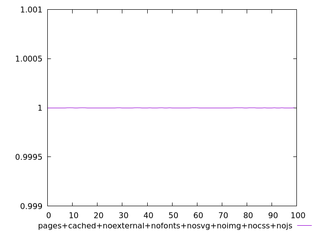
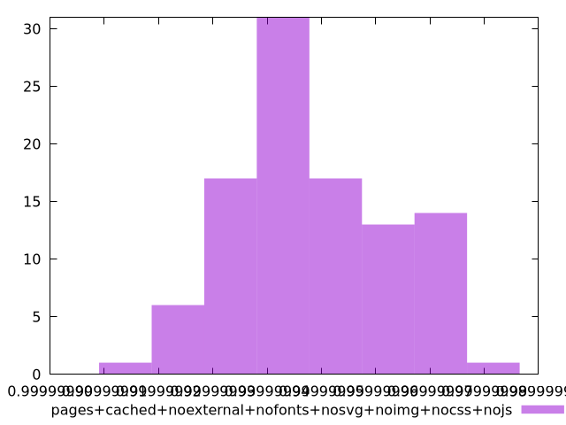
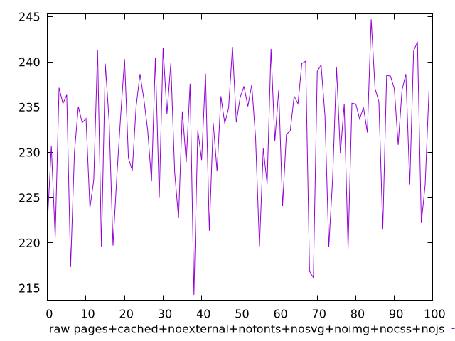
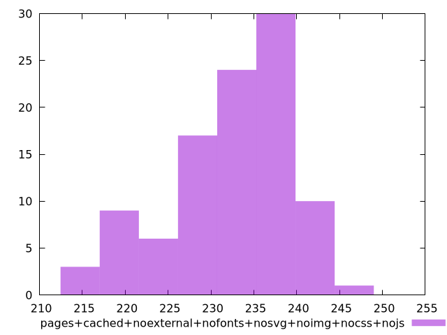

# Report pages+cached+noexternal+nofonts+nosvg+noimg+nocss+nojs

[parent..](./..)  


## Scores

  

## Score Histogram

  

## Score Indicators

```yaml
min: 0.9999999149055687
max: 0.9999999784760136
range: 6.357044490812314e-8
mean: 0.9999999482175993
median: 0.999999946276703
stdev: 1.4486561364012793e-8
skewness: 0.20797706169265456

```

## Raw Values

  

## Raw Values Histogram

  

## Raw Indicators

```yaml
min: 214.26399999999992
max: 244.70799999999997
range: 30.444000000000045
mean: 232.20327999999995
median: 233.91599999999997
stdev: 6.947418706368582
skewness: -0.6791928805440268

```

<style>
  img {
    max-width: 80%;
  }
</style>
      
