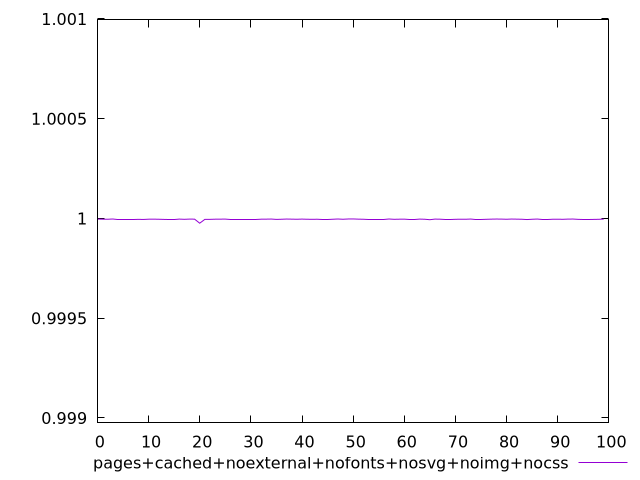
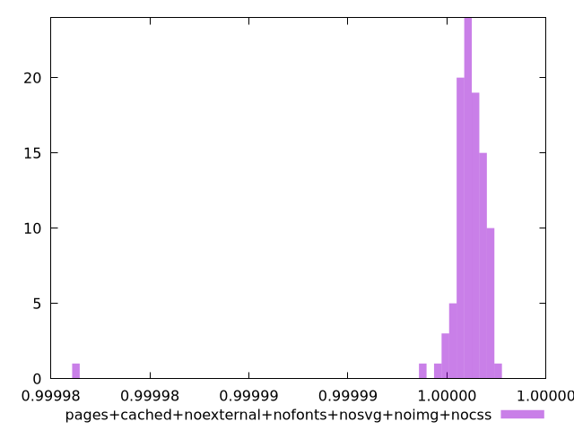
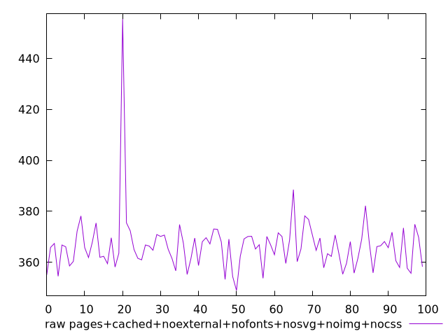
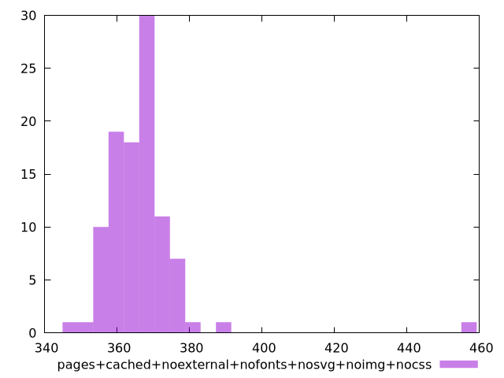

# Report pages+cached+noexternal+nofonts+nosvg+noimg+nocss

[parent..](./..)  


## Scores

  

## Score Histogram

  

## Score Indicators

```yaml
min: 0.9999761645434592
max: 0.999997505055432
range: 0.00002134051197277831
mean: 0.9999959919494061
median: 0.999996172984473
stdev: 0.0000020901591246156065
skewness: -8.530234889918107

```

## Raw Values

  

## Raw Values Histogram

  

## Raw Indicators

```yaml
min: 348.948
max: 455.44399999999996
range: 106.49599999999998
mean: 366.46876000000026
median: 366.252
stdev: 11.220889885494818
skewness: 4.949290905548707

```

<style>
  img {
    max-width: 80%;
  }
</style>
      
