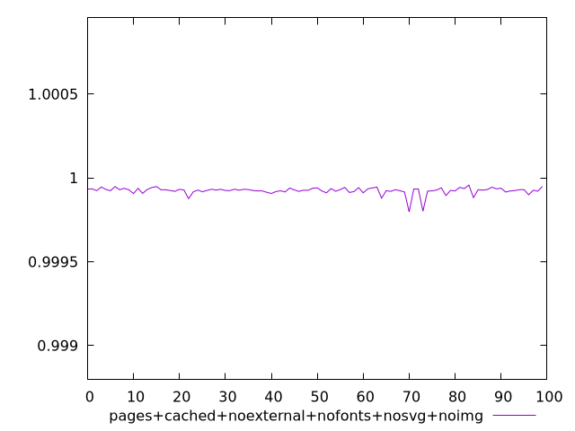
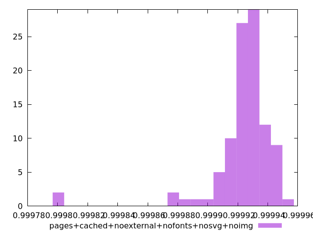
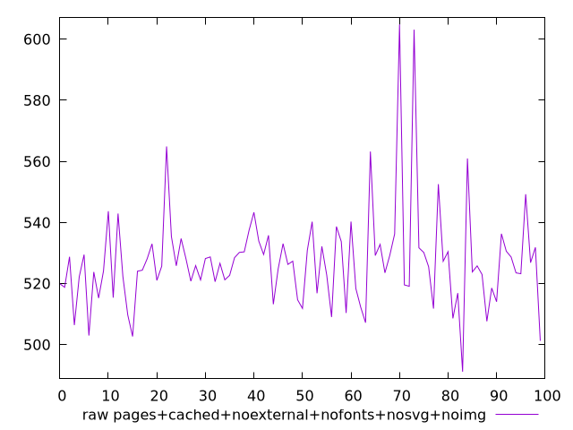

# Report pages+cached+noexternal+nofonts+nosvg+noimg

[parent..](./..)  


## Scores

  

## Score Histogram

  

## Score Indicators

```yaml
min: 0.9997967906032095
max: 0.9999567034424399
range: 0.0001599128392304472
mean: 0.999923546976834
median: 0.9999269771382092
stdev: 0.000022366245180341875
skewness: -3.605743506181112

```

## Raw Values

  

## Raw Values Histogram

  

## Raw Indicators

```yaml
min: 491.1840000000001
max: 604.8239999999998
range: 113.63999999999976
mean: 527.3657199999998
median: 525.8639999999999
stdev: 16.426672507893972
skewness: 2.0609304283038115

```

<style>
  img {
    max-width: 80%;
  }
</style>
      
