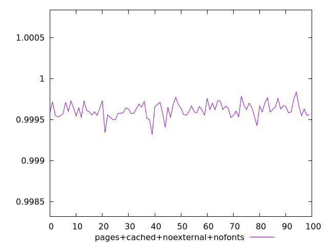
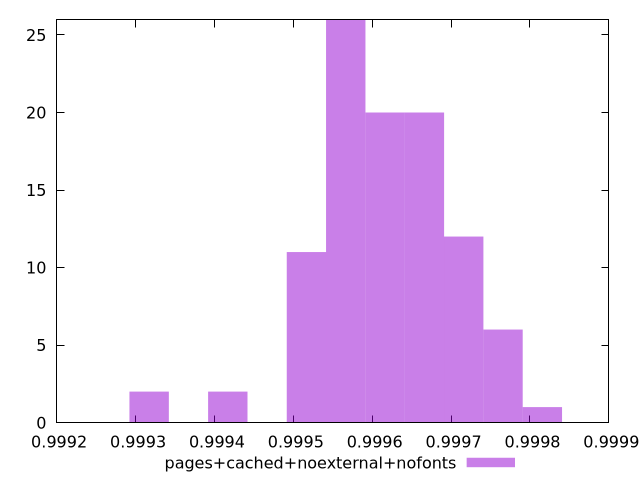
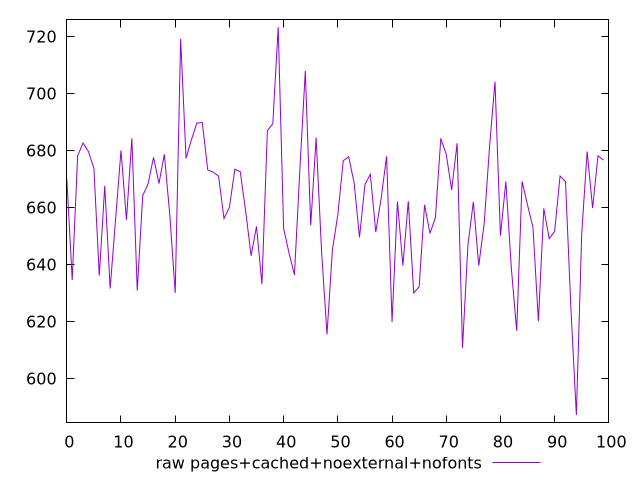
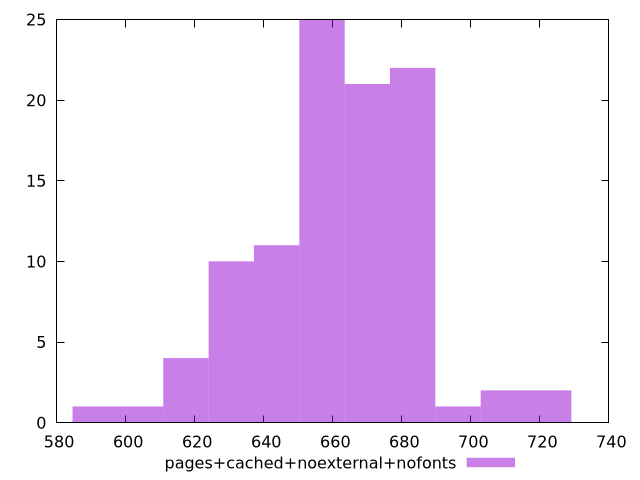

# Report pages+cached+noexternal+nofonts

[parent..](./..)  


## Scores

  

## Score Histogram

  

## Score Indicators

```yaml
min: 0.9993156727224216
max: 0.9998353806058917
range: 0.0005197078834701108
mean: 0.9996152410822794
median: 0.9996192195506663
stdev: 0.00008788230741030343
skewness: -0.47287960821355624

```

## Raw Values

  

## Raw Values Histogram

  

## Raw Indicators

```yaml
min: 587.2280000000002
max: 723.2600000000006
range: 136.03200000000038
mean: 661.1350800000001
median: 662.1500000000003
stdev: 22.687738685765936
skewness: -0.26683515488789394

```

<style>
  img {
    max-width: 80%;
  }
</style>
      
