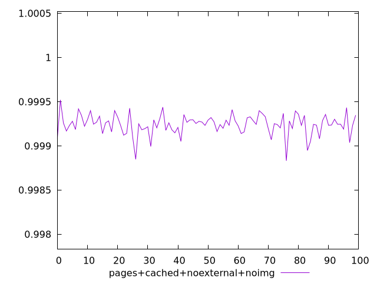
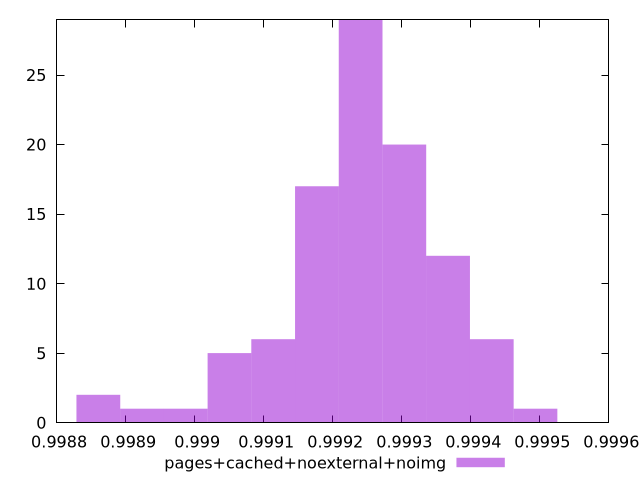
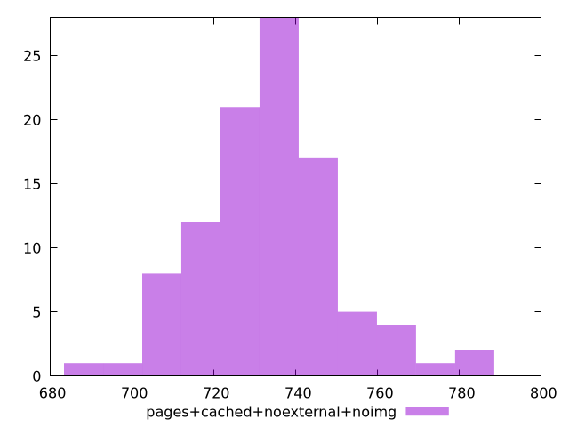

# Report pages+cached+noexternal+noimg

[parent..](./..)  


## Scores

  

## Score Histogram

  

## Score Indicators

```yaml
min: 0.998831165827192
max: 0.9995197415404649
range: 0.0006885757132728543
mean: 0.9992417057413809
median: 0.9992452304067705
stdev: 0.00011529658907544111
skewness: -0.8786216269231032

```

## Raw Values

  

## Raw Values Histogram

  

## Raw Indicators

```yaml
min: 685.3880000000013
max: 786.7920000000007
range: 101.40399999999943
mean: 733.8554000000004
median: 734.2940000000001
stdev: 16.918167809783576
skewness: 0.36443282906456936

```

<style>
  img {
    max-width: 80%;
  }
</style>
      
