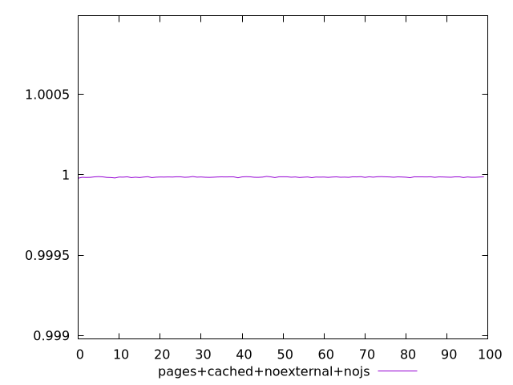
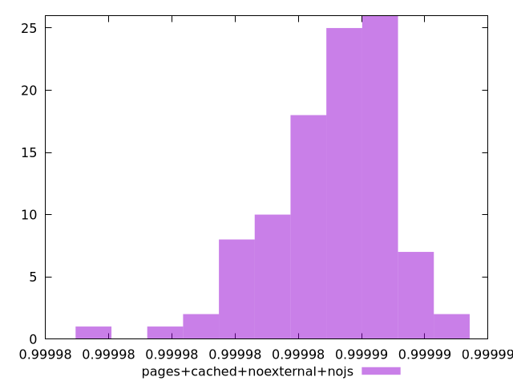
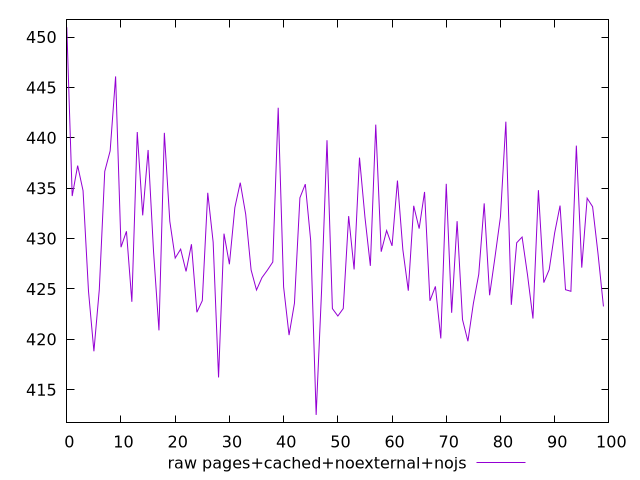
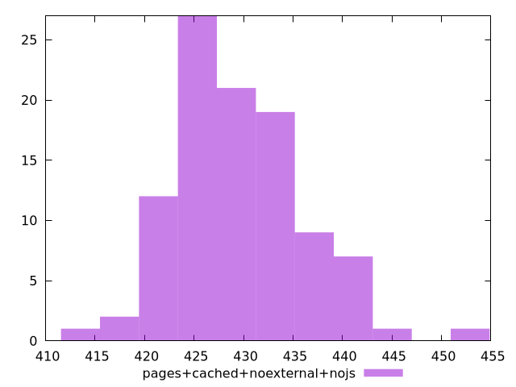

# Report pages+cached+noexternal+nojs

[parent..](./..)  


## Scores

  

## Score Histogram

  

## Score Indicators

```yaml
min: 0.9999779801205365
max: 0.9999894122389575
range: 0.000011432118421028648
mean: 0.9999850855948453
median: 0.9999853626132964
stdev: 0.000001912076506876232
skewness: -0.8145542876894054

```

## Raw Values

  

## Raw Values Histogram

  

## Raw Indicators

```yaml
min: 412.49599999999987
max: 450.98
range: 38.48400000000015
mean: 429.56055999999984
median: 428.924
stdev: 6.534284010234034
skewness: 0.4554687256970575

```

<style>
  img {
    max-width: 80%;
  }
</style>
      
