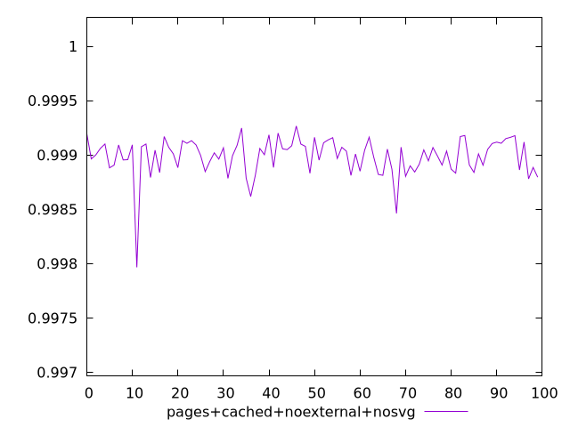
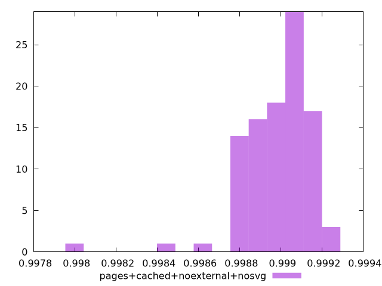
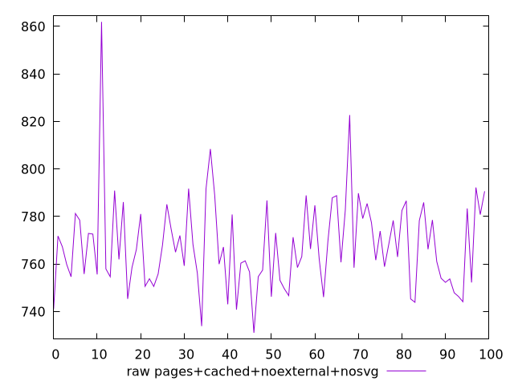
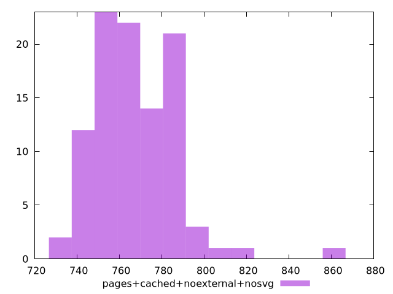

# Report pages+cached+noexternal+nosvg

[parent..](./..)  


## Scores

  

## Score Histogram

  

## Score Indicators

```yaml
min: 0.997966367600216
max: 0.9992662973274686
range: 0.00129992972725268
mean: 0.9989861489289139
median: 0.9990151006833603
stdev: 0.00017324235195478806
skewness: -2.2990906216318776

```

## Raw Values

  

## Raw Values Histogram

  

## Raw Indicators

```yaml
min: 731.0800000000007
max: 861.9240000000001
range: 130.84399999999937
mean: 767.9369600000005
median: 765.5799999999999
stdev: 19.1058930311671
skewness: 1.3409373997341547

```

<style>
  img {
    max-width: 80%;
  }
</style>
      
