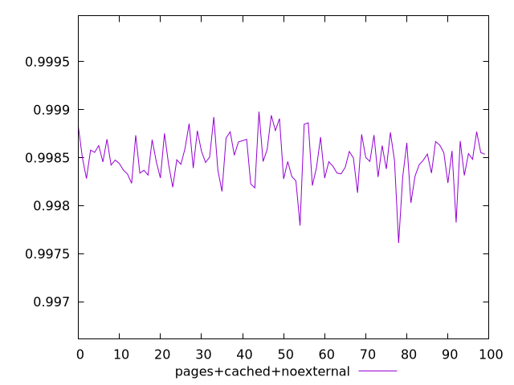
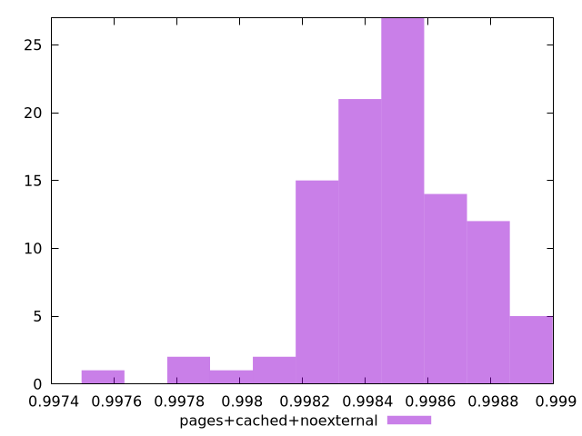
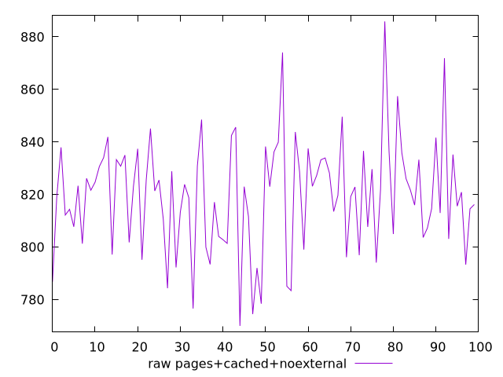
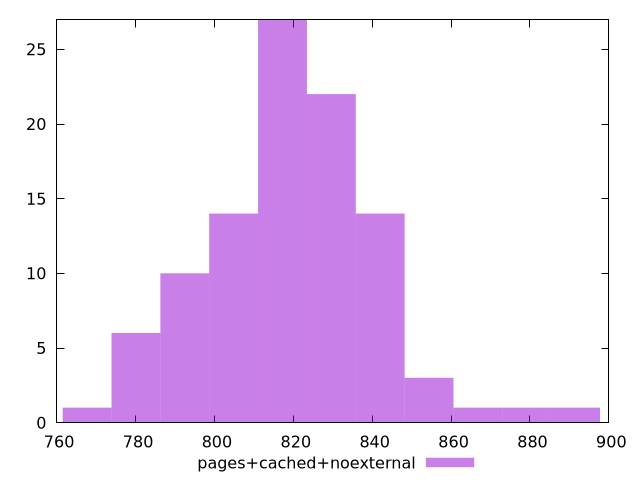

# Report pages+cached+noexternal

[parent..](./..)  


## Scores

  

## Score Histogram

  

## Score Indicators

```yaml
min: 0.9976105978692127
max: 0.9989786639992547
range: 0.0013680661300420338
mean: 0.9984845337632694
median: 0.9984734842210169
stdev: 0.00023973275898260923
skewness: -0.6120768240436055

```

## Raw Values

  

## Raw Values Histogram

  

## Raw Indicators

```yaml
min: 770.0079999999998
max: 885.884
range: 115.8760000000002
mean: 819.4809600000001
median: 821.7000000000005
stdev: 21.104527257401454
skewness: 0.1518419850976244

```

<style>
  img {
    max-width: 80%;
  }
</style>
      
