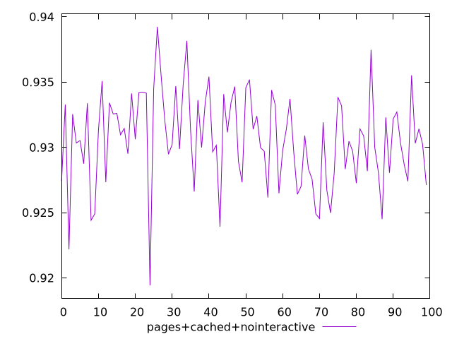
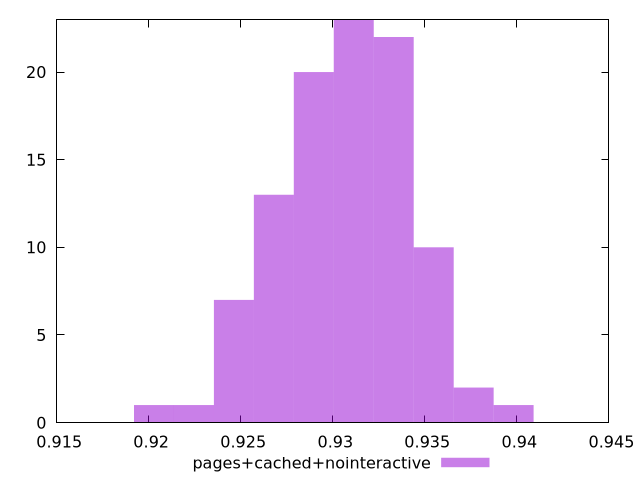
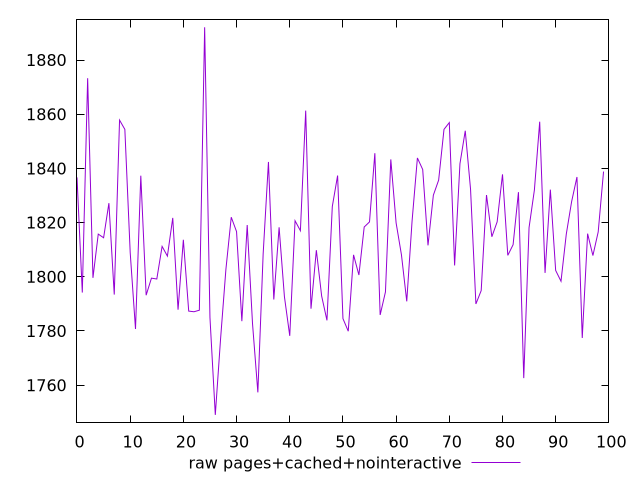
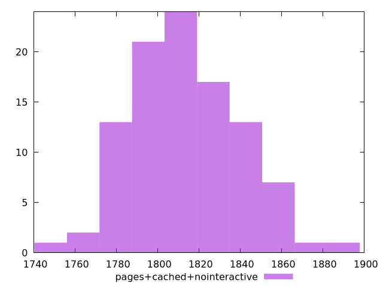

# Report pages+cached+nointeractive

[parent..](./..)  


## Scores

  

## Score Histogram

  

## Score Indicators

```yaml
min: 0.9194252963150875
max: 0.9392308691762613
range: 0.019805572861173792
mean: 0.9305991569203976
median: 0.9305709447073413
stdev: 0.003525161223374827
skewness: -0.32707326176773127

```

## Raw Values

  

## Raw Values Histogram

  

## Raw Indicators

```yaml
min: 1749.0479999999998
max: 1892.0840000000007
range: 143.03600000000097
mean: 1813.5191200000015
median: 1814.0420000000006
stdev: 25.5411553541651
skewness: 0.2503093779073525

```

<style>
  img {
    max-width: 80%;
  }
</style>
      
