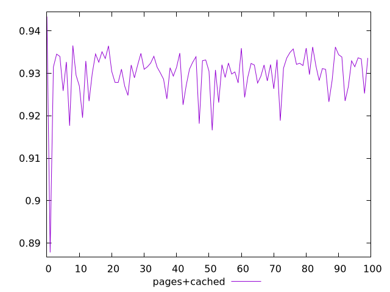
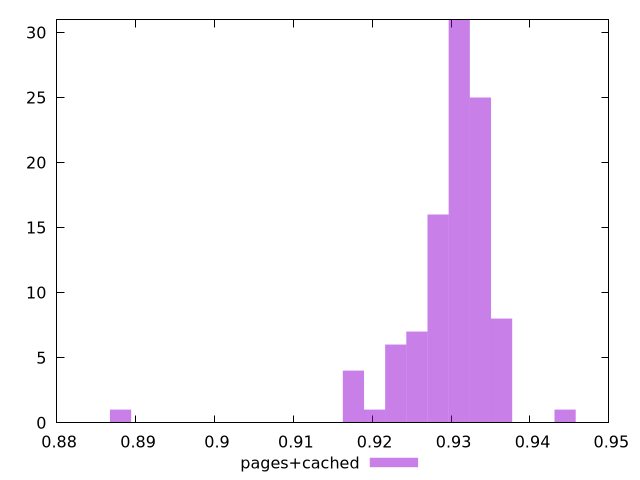
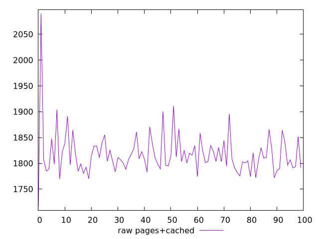
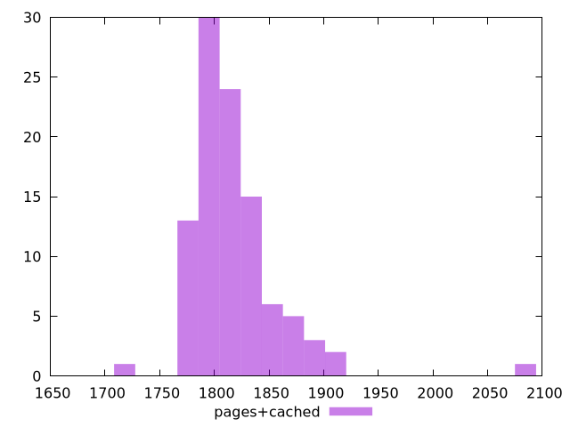

# Report pages+cached

[parent..](./..)  


## Scores

  

## Score Histogram

  

## Score Indicators

```yaml
min: 0.887794084686461
max: 0.9433849507342112
range: 0.05559086604775021
mean: 0.9299385253769252
median: 0.9313693498530425
stdev: 0.006174196843338644
skewness: -3.394825360599865

```

## Raw Values

  

## Raw Values Histogram

  

## Raw Indicators

```yaml
min: 1716.1960000000008
max: 2090.1399999999826
range: 373.94399999998177
mean: 1817.7851200000011
median: 1808.226000000001
stdev: 42.29379365563578
skewness: 2.874050690805721

```

<style>
  img {
    max-width: 80%;
  }
</style>
      
