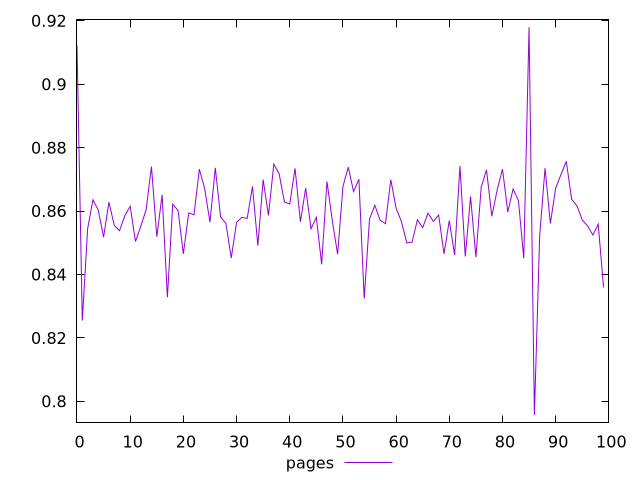
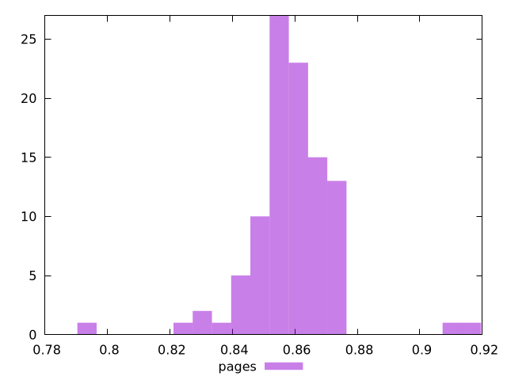
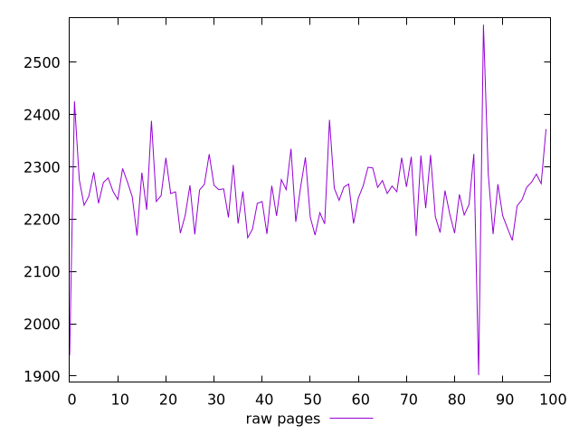
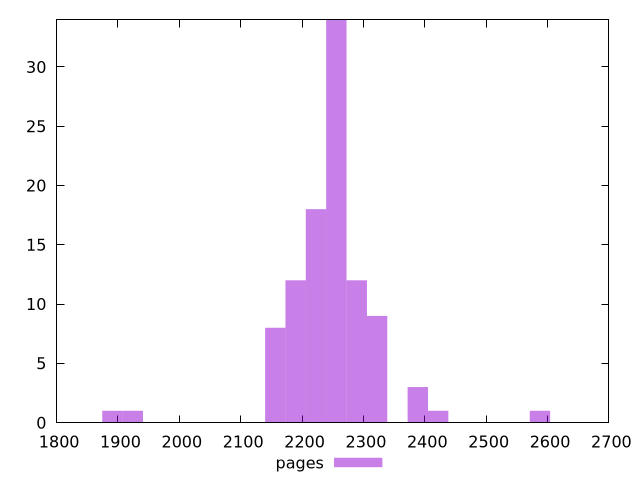

# Report pages

[parent..](./..)  


## Scores

  

## Score Histogram

  

## Score Indicators

```yaml
min: 0.7957300190824915
max: 0.917974311846788
range: 0.12224429276429649
mean: 0.8594522974159079
median: 0.8586158392450263
stdev: 0.014053843572197126
skewness: 0.04824011956502585

```

## Raw Values

  

## Raw Values Histogram

  

## Raw Indicators

```yaml
min: 1901.8560000000002
max: 2572.1599999999935
range: 670.3039999999933
mean: 2247.5168399999843
median: 2253.383999999981
stdev: 76.88436795353107
skewness: -0.5548104908773969

```

<style>
  img {
    max-width: 80%;
  }
</style>
      
