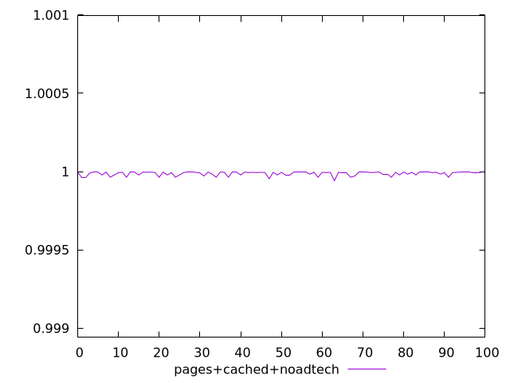
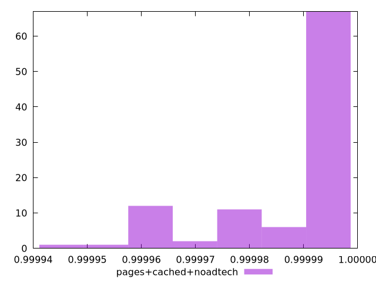
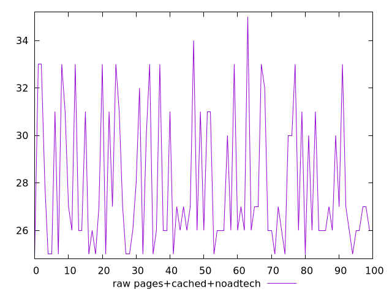
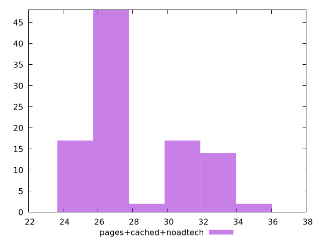

# Report pages+cached+noadtech

[parent..](./..)  


## Scores

  

## Score Histogram

  

## Score Indicators

```yaml
min: 0.9999416738899494
max: 0.9999967944940666
range: 0.00005512060411727582
mean: 0.9999874865638015
median: 0.9999935431491718
stdev: 0.000012450734644673284
skewness: -1.4298278100370905

```

## Raw Values

  

## Raw Values Histogram

  

## Raw Indicators

```yaml
min: 25
max: 35
range: 10
mean: 27.95
median: 27
stdev: 2.8926631328241466
skewness: 0.795941350395479

```

<style>
  img {
    max-width: 80%;
  }
</style>
      
