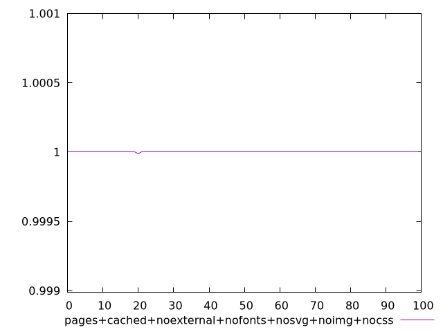
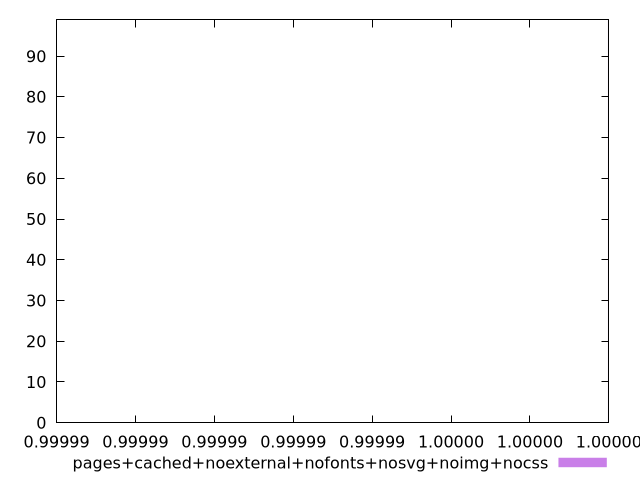
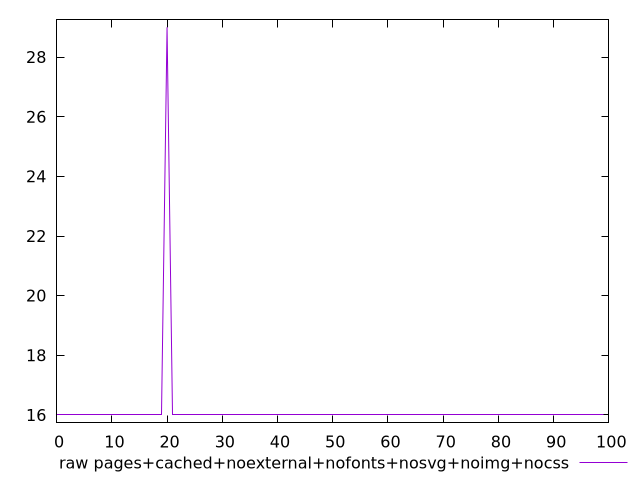
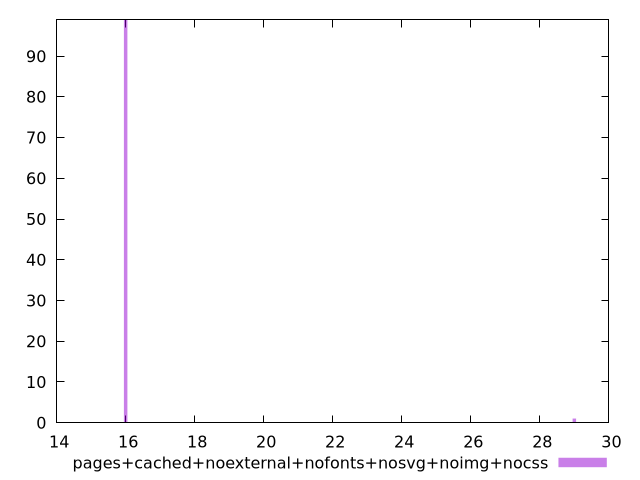

# Report pages+cached+noexternal+nofonts+nosvg+noimg+nocss

[parent..](./..)  


## Scores

  

## Score Histogram

  

## Score Indicators

```yaml
min: 0.9999878682154684
max: 0.9999999641342965
range: 0.00001209591882811445
mean: 0.9999998431751059
median: 0.9999999641342965
stdev: 0.0000012035287274235297
skewness: -9.84937058387819

```

## Raw Values

  

## Raw Values Histogram

  

## Raw Indicators

```yaml
min: 16
max: 29
range: 13
mean: 16.13
median: 16
stdev: 1.2934836682386055
skewness: 9.849370589540316

```

<style>
  img {
    max-width: 80%;
  }
</style>
      
