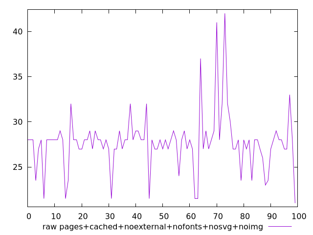

# Report pages+cached+noexternal+nofonts+nosvg+noimg

[parent..](./..)  


## Scores

  

## Score Histogram

  

## Score Indicators

```yaml
min: 0.9997636670093073
max: 0.9999993949667043
range: 0.0002357279573970139
mean: 0.9999861500189611
median: 0.9999910785021199
stdev: 0.0000308775527363757
skewness: -6.001810896262069

```

## Raw Values

  

## Raw Values Histogram

  

## Raw Indicators

```yaml
min: 21
max: 42
range: 21
mean: 27.705
median: 28
stdev: 3.2094353085862335
skewness: 1.3251528927778287

```

<style>
  img {
    max-width: 80%;
  }
</style>
      
