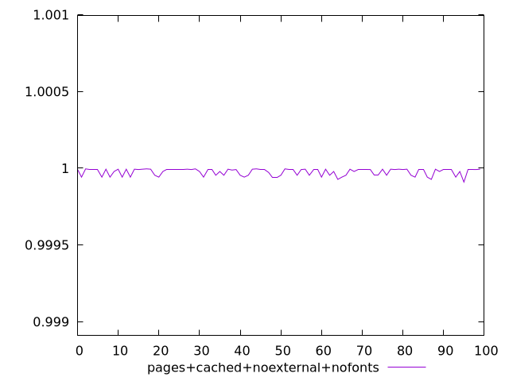
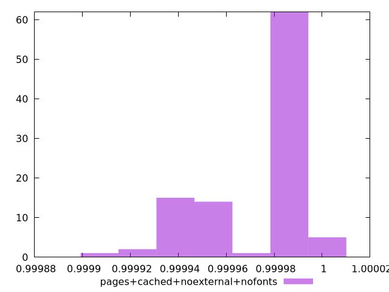
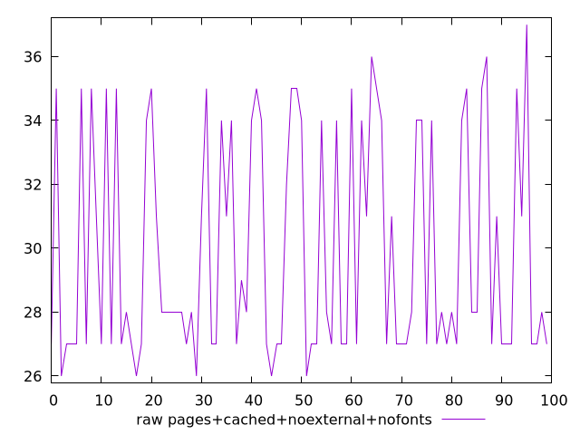
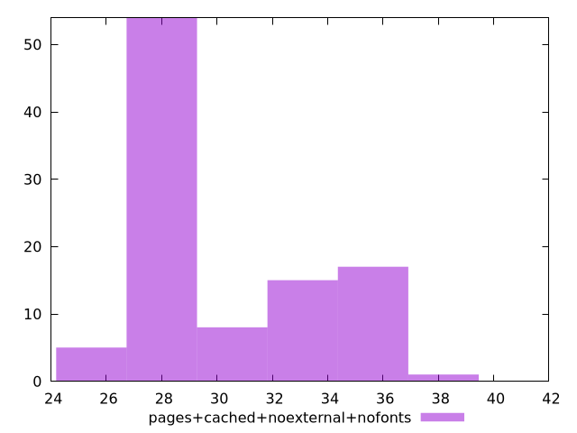

# Report pages+cached+noexternal+nofonts

[parent..](./..)  


## Scores

  

## Score Histogram

  

## Score Indicators

```yaml
min: 0.9999095029848146
max: 0.9999954072993993
range: 0.00008590431458466163
mean: 0.9999762797206797
median: 0.9999910785021199
stdev: 0.000022575711794912104
skewness: -0.9006174515630299

```

## Raw Values

  

## Raw Values Histogram

  

## Raw Indicators

```yaml
min: 26
max: 37
range: 11
mean: 29.95
median: 28
stdev: 3.485326383568691
skewness: 0.537867844319737

```

<style>
  img {
    max-width: 80%;
  }
</style>
      
