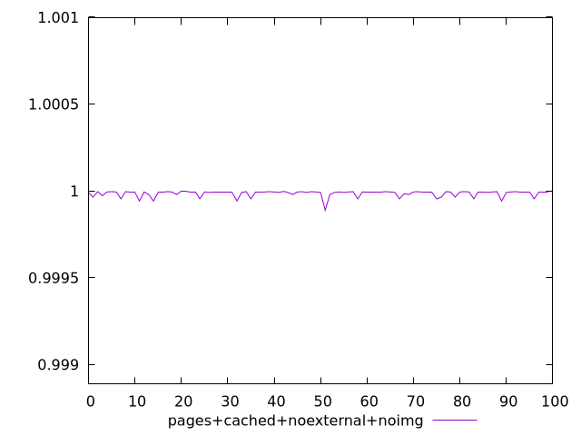
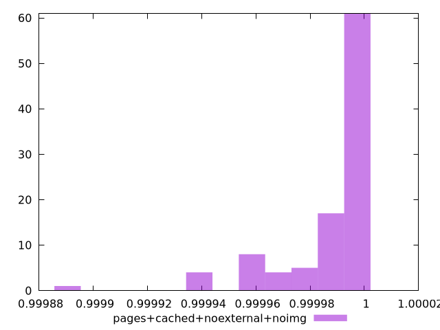
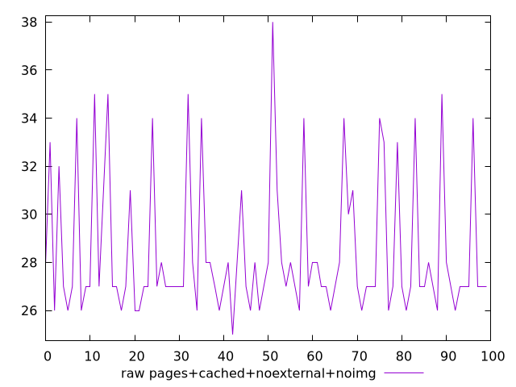
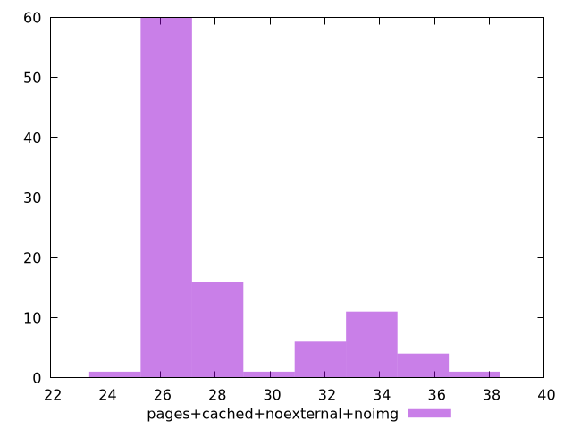

# Report pages+cached+noexternal+noimg

[parent..](./..)  


## Scores

  

## Score Histogram

  

## Score Indicators

```yaml
min: 0.9998887110535106
max: 0.9999967944940666
range: 0.00010808344055601715
mean: 0.999985240332374
median: 0.9999935431491718
stdev: 0.000017885248107371703
skewness: -2.5596621295261026

```

## Raw Values

  

## Raw Values Histogram

  

## Raw Indicators

```yaml
min: 25
max: 38
range: 13
mean: 28.42
median: 27
stdev: 2.8746478045144936
skewness: 1.4428062786474738

```

<style>
  img {
    max-width: 80%;
  }
</style>
      
