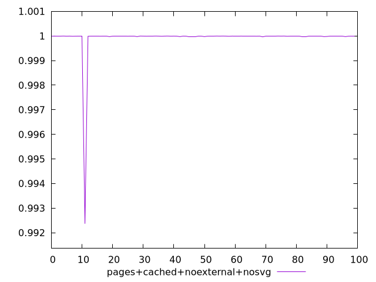
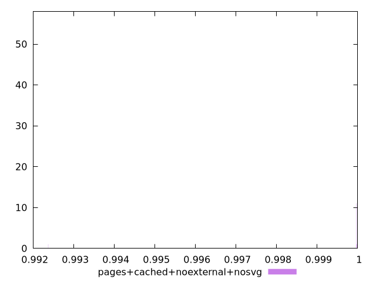
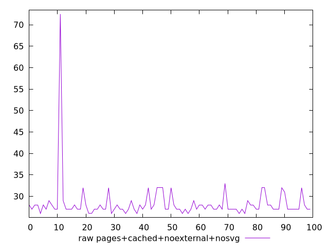
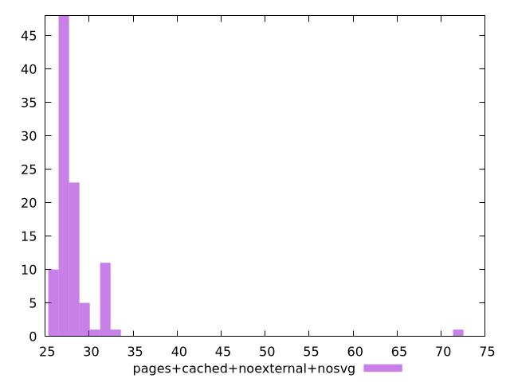

# Report pages+cached+noexternal+nosvg

[parent..](./..)  


## Scores

  

## Score Histogram

  

## Score Indicators

```yaml
min: 0.9923660363038256
max: 0.9999954072993993
range: 0.007629370995573703
mean: 0.9999137811756992
median: 0.9999935431491718
stdev: 0.0007586121336970775
skewness: -9.847972202179312

```

## Raw Values

  

## Raw Values Histogram

  

## Raw Indicators

```yaml
min: 26
max: 72.5
range: 46.5
mean: 28.335
median: 27
stdev: 4.766578961897095
skewness: 7.993406153038824

```

<style>
  img {
    max-width: 80%;
  }
</style>
      
