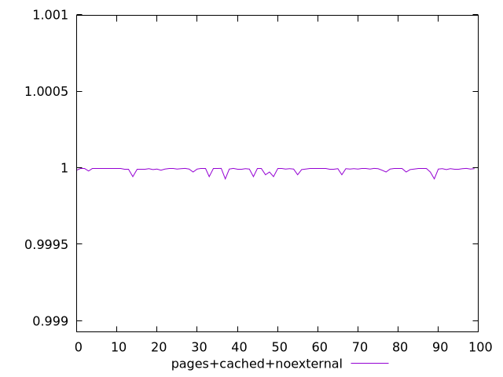
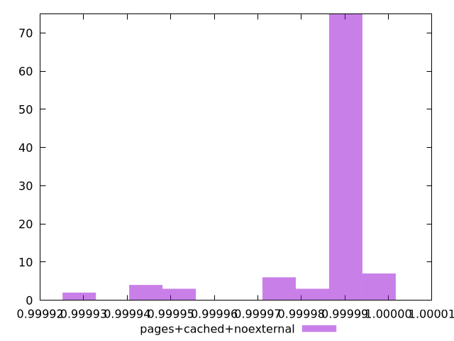
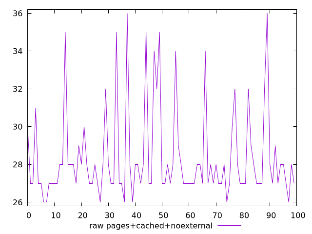
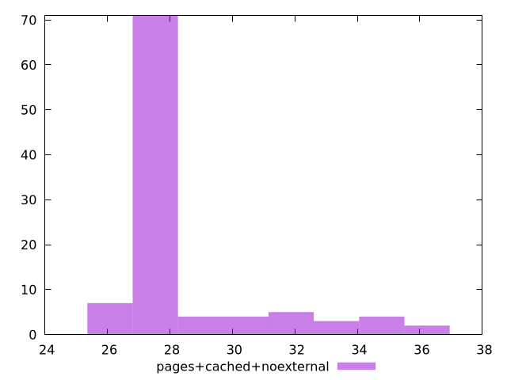

# Report pages+cached+noexternal

[parent..](./..)  


## Scores

  

## Score Histogram

  

## Score Indicators

```yaml
min: 0.9999270232664161
max: 0.9999954072993993
range: 0.00006838403298314866
mean: 0.9999866359347273
median: 0.9999923108256459
stdev: 0.0000150802619632688
skewness: -2.5902577735336325

```

## Raw Values

  

## Raw Values Histogram

  

## Raw Indicators

```yaml
min: 26
max: 36
range: 10
mean: 28.38
median: 27.5
stdev: 2.4363086832337166
skewness: 1.8241219996947244

```

<style>
  img {
    max-width: 80%;
  }
</style>
      
