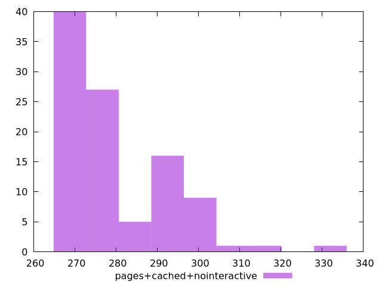

# Report pages+cached+nointeractive

[parent..](./..)  


## Scores

  

## Score Histogram

  

## Score Indicators

```yaml
min: 0.2931873605519907
max: 0.4487066999006886
range: 0.15551933934869794
mean: 0.41297776956168036
median: 0.4301220143240734
stdev: 0.03281126636218166
skewness: -1.2135702925672172

```

## Raw Values

  

## Raw Values Histogram

  

## Raw Indicators

```yaml
min: 267
max: 329.9999999999982
range: 62.99999999999818
mean: 280.09
median: 273.5
stdev: 12.592136435093037
skewness: 1.3667897160402194

```

<style>
  img {
    max-width: 80%;
  }
</style>
      
