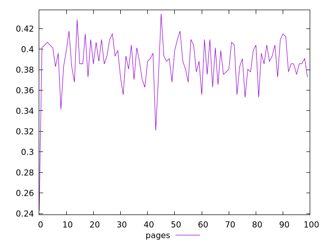
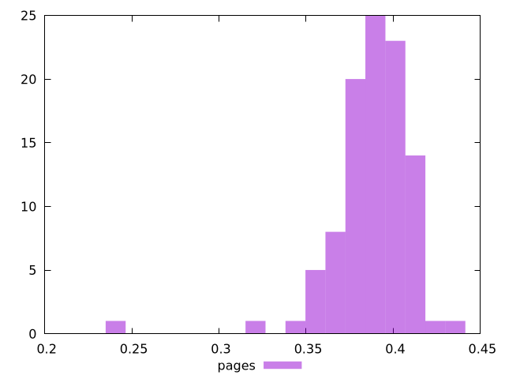
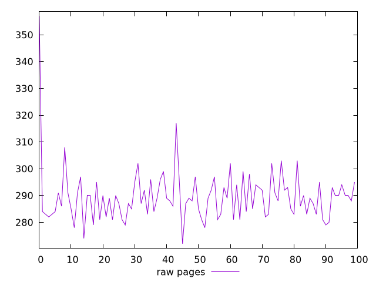
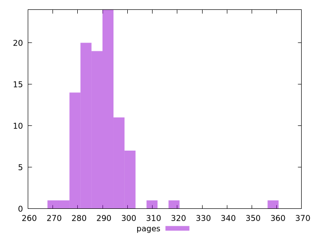

# Report pages

[parent..](./..)  


## Scores

  

## Score Histogram

  

## Score Indicators

```yaml
min: 0.2425197073059409
max: 0.4343578459053614
range: 0.1918381385994205
mean: 0.3875484531659861
median: 0.38816658760399136
stdev: 0.023701467907701806
skewness: -2.451162222631566

```

## Raw Values

  

## Raw Values Histogram

  

## Raw Indicators

```yaml
min: 271.9999999999982
max: 357
range: 85.00000000000182
mean: 289.49999999999983
median: 289
stdev: 9.954396013822327
skewness: 3.2926421610019925

```

<style>
  img {
    max-width: 80%;
  }
</style>
      
