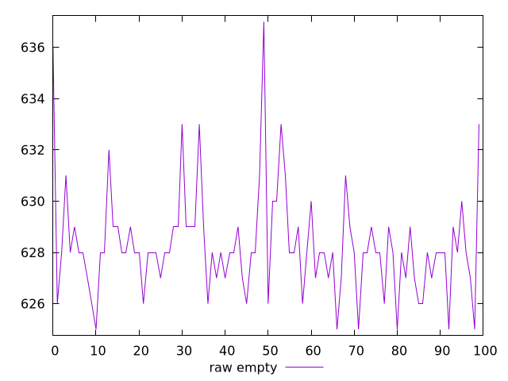
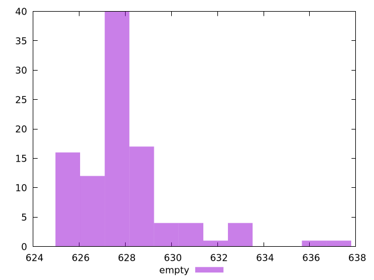

# Report empty

[parent..](./..)  


## Scores

  

## Score Histogram

  

## Score Indicators

```yaml
{}

```

## Raw Values

  

## Raw Values Histogram

  

## Raw Indicators

```yaml
min: 625
max: 637
range: 12
mean: 628.28
median: 628
stdev: 2.069202745020411
skewness: 1.5194431198227178

```

<style>
  img {
    max-width: 80%;
  }
</style>
      
