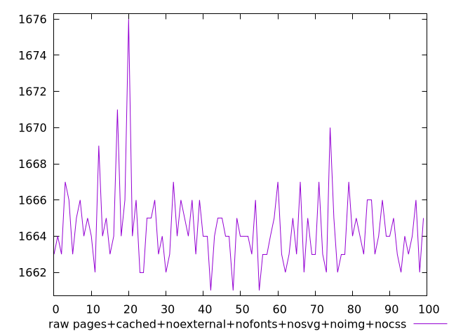
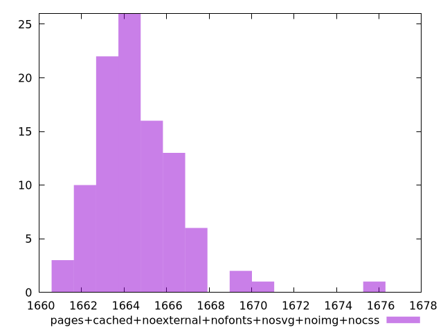

# Report pages+cached+noexternal+nofonts+nosvg+noimg+nocss

[parent..](./..)  


## Scores

  

## Score Histogram

  

## Score Indicators

```yaml
{}

```

## Raw Values

  

## Raw Values Histogram

  

## Raw Indicators

```yaml
min: 1661
max: 1676
range: 15
mean: 1664.39
median: 1664
stdev: 2.1208253110522794
skewness: 2.074389172162483

```

<style>
  img {
    max-width: 80%;
  }
</style>
      
