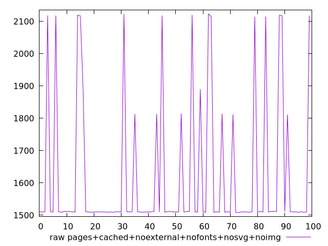
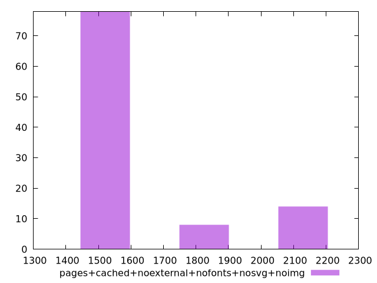

# Report pages+cached+noexternal+nofonts+nosvg+noimg

[parent..](./..)  


## Scores

  

## Score Histogram

  

## Score Indicators

```yaml
{}

```

## Raw Values

  

## Raw Values Histogram

  

## Raw Indicators

```yaml
min: 1508
max: 2123
range: 615
mean: 1621.08
median: 1510.5
stdev: 218.76076796354505
skewness: 1.6193707856004624

```

<style>
  img {
    max-width: 80%;
  }
</style>
      
