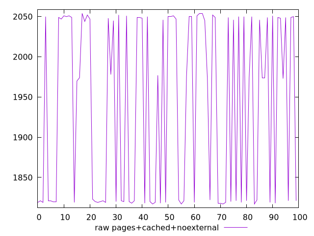
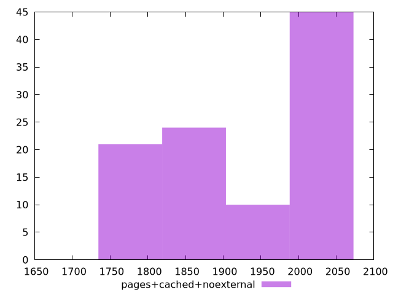

# Report pages+cached+noexternal

[parent..](./..)  


## Scores

  

## Score Histogram

  

## Score Indicators

```yaml
{}

```

## Raw Values

  

## Raw Values Histogram

  

## Raw Indicators

```yaml
min: 1817
max: 2054
range: 237
mean: 1938.49
median: 1974
stdev: 109.62002508666014
skewness: -0.10377002761961403

```

<style>
  img {
    max-width: 80%;
  }
</style>
      
