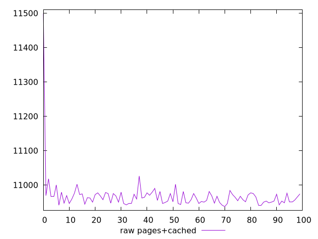
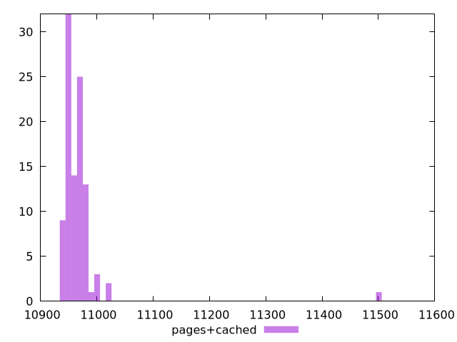

# Report pages+cached

[parent..](./..)  


## Scores

  

## Score Histogram

  

## Score Indicators

```yaml
{}

```

## Raw Values

  

## Raw Values Histogram

  

## Raw Indicators

```yaml
min: 10937
max: 11499
range: 562
mean: 10968
median: 10962
stdev: 55.95105003482955
skewness: 8.55057512270664

```

<style>
  img {
    max-width: 80%;
  }
</style>
      
