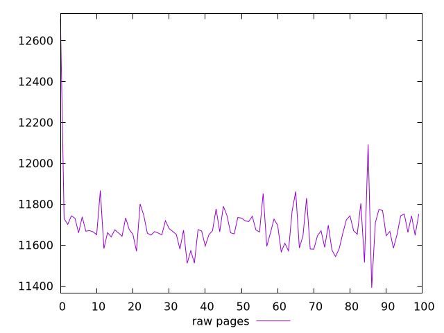
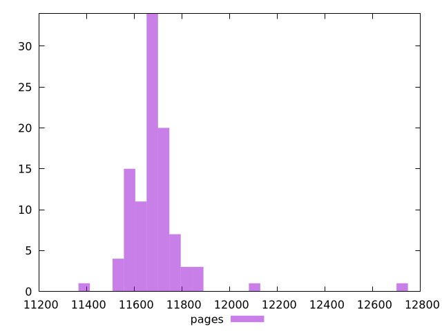

# Report pages

[parent..](./..)  


## Scores

  

## Score Histogram

  

## Score Indicators

```yaml
{}

```

## Raw Values

  

## Raw Values Histogram

  

## Raw Indicators

```yaml
min: 11391
max: 12706
range: 1315
mean: 11687.37
median: 11667
stdev: 135.60122823927517
skewness: 4.354302780273307

```

<style>
  img {
    max-width: 80%;
  }
</style>
      
