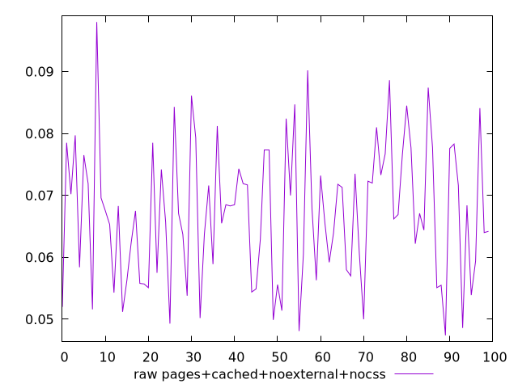
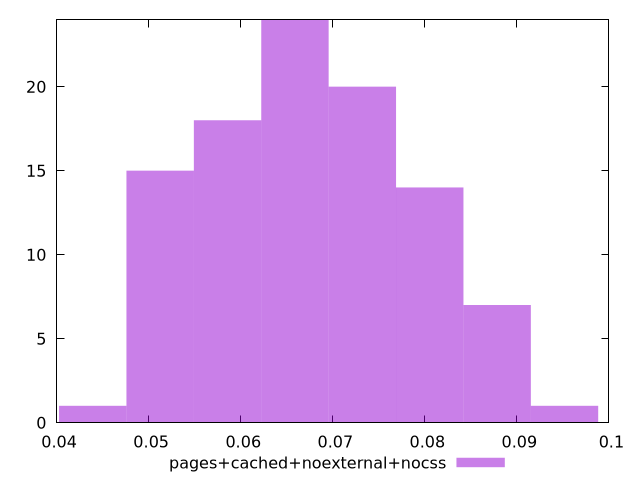

# Report pages+cached+noexternal+nocss

[parent..](./..)  


## Scores

  

## Score Histogram

  

## Score Indicators

```yaml
{}

```

## Raw Values

  

## Raw Values Histogram

  

## Raw Indicators

```yaml
min: 0.0474
max: 0.09799999999999998
range: 0.05059999999999998
mean: 0.06709999999999997
median: 0.0673
stdev: 0.011130076369908697
skewness: 0.22292231083933886

```

<style>
  img {
    max-width: 80%;
  }
</style>
      
