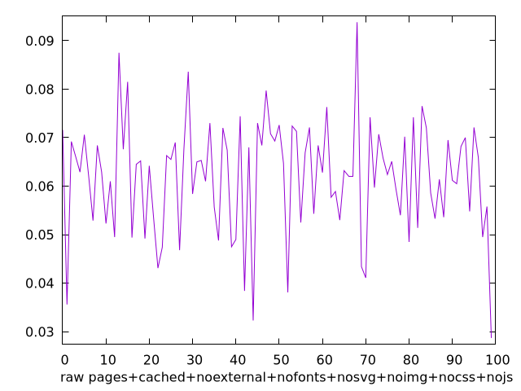

# Report pages+cached+noexternal+nofonts+nosvg+noimg+nocss+nojs

[parent..](./..)  


## Scores

  

## Score Histogram

  

## Score Indicators

```yaml
{}

```

## Raw Values

  

## Raw Values Histogram

  

## Raw Indicators

```yaml
min: 0.028699999999999996
max: 0.0938
range: 0.06509999999999999
mean: 0.061888999999999986
median: 0.06369999999999999
stdev: 0.011631164129183283
skewness: -0.3700557840417943

```

<style>
  img {
    max-width: 80%;
  }
</style>
      
