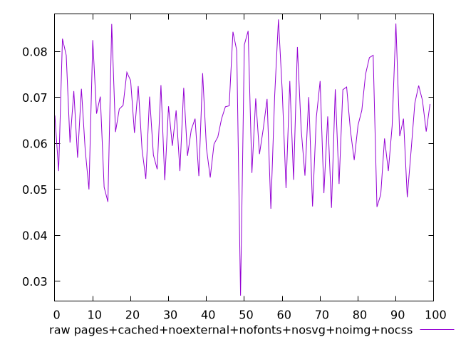
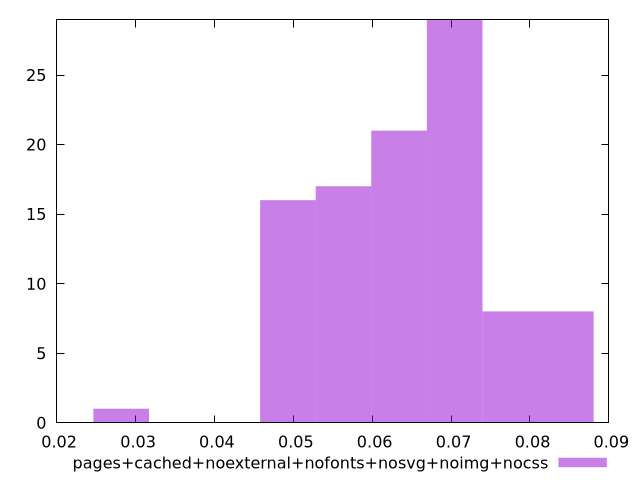

# Report pages+cached+noexternal+nofonts+nosvg+noimg+nocss

[parent..](./..)  


## Scores

  

## Score Histogram

  

## Score Indicators

```yaml
{}

```

## Raw Values

  

## Raw Values Histogram

  

## Raw Indicators

```yaml
min: 0.0269
max: 0.087
range: 0.060099999999999994
mean: 0.06445599999999997
median: 0.0654
stdev: 0.011119679132061319
skewness: -0.21918989904545672

```

<style>
  img {
    max-width: 80%;
  }
</style>
      
