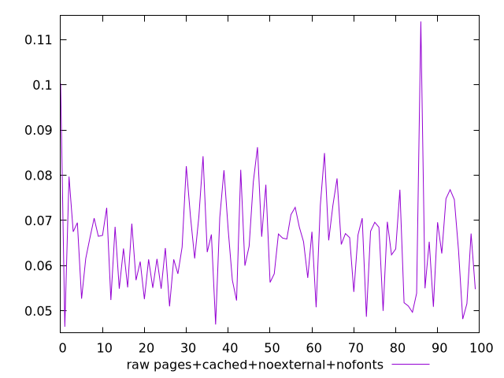
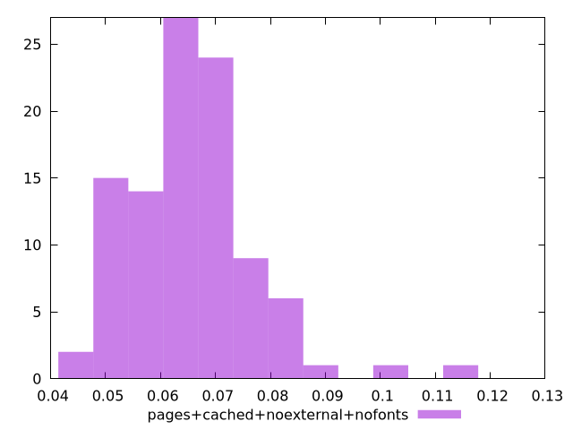

# Report pages+cached+noexternal+nofonts

[parent..](./..)  


## Scores

  

## Score Histogram

  

## Score Indicators

```yaml
{}

```

## Raw Values

  

## Raw Values Histogram

  

## Raw Indicators

```yaml
min: 0.0465
max: 0.11399999999999998
range: 0.06749999999999998
mean: 0.06521600000000001
median: 0.06575
stdev: 0.011108327686920291
skewness: 1.0762367192511266

```

<style>
  img {
    max-width: 80%;
  }
</style>
      
