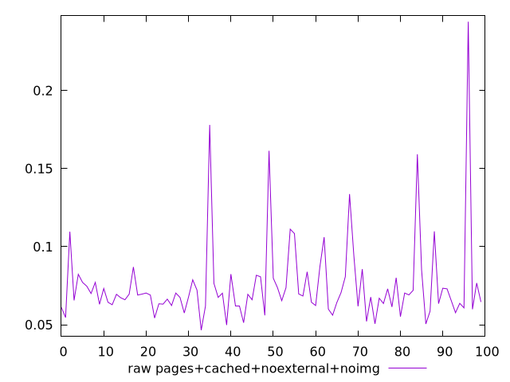

# Report pages+cached+noexternal+noimg

[parent..](./..)  


## Scores

  

## Score Histogram

  

## Score Indicators

```yaml
{}

```

## Raw Values

  

## Raw Values Histogram

  

## Raw Indicators

```yaml
min: 0.0465
max: 0.24409999999999998
range: 0.1976
mean: 0.07529999999999998
median: 0.06899999999999999
stdev: 0.027489987268094537
skewness: 3.5225046639331357

```

<style>
  img {
    max-width: 80%;
  }
</style>
      
