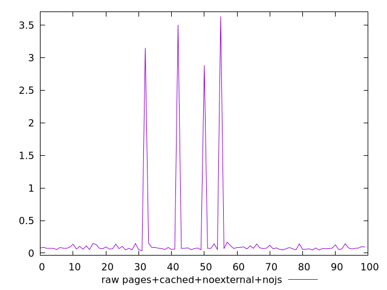
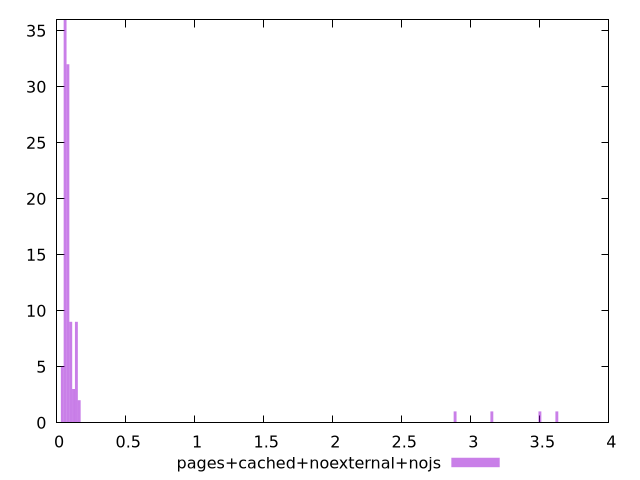

# Report pages+cached+noexternal+nojs

[parent..](./..)  


## Scores

  

## Score Histogram

  

## Score Indicators

```yaml
{}

```

## Raw Values

  

## Raw Values Histogram

  

## Raw Indicators

```yaml
min: 0.0382
max: 3.6319999999999997
range: 3.5938
mean: 0.21061999999999997
median: 0.07425
stdev: 0.6322959508015211
skewness: 4.745593562508287

```

<style>
  img {
    max-width: 80%;
  }
</style>
      
