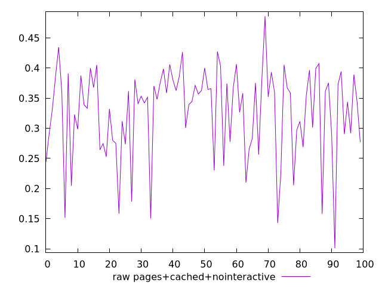
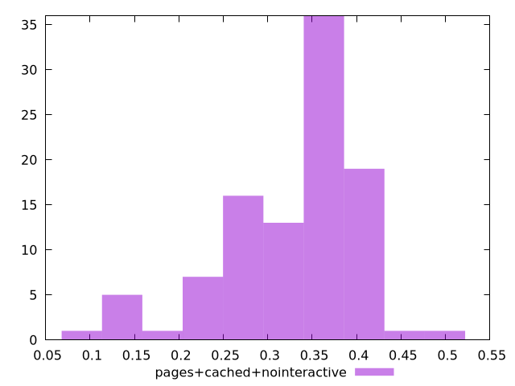

# Report pages+cached+nointeractive

[parent..](./..)  


## Scores

  

## Score Histogram

  

## Score Indicators

```yaml
{}

```

## Raw Values

  

## Raw Values Histogram

  

## Raw Indicators

```yaml
min: 0.10109999999999997
max: 0.486
range: 0.3849
mean: 0.32749198065367957
median: 0.3518990326839774
stdev: 0.07394858351067225
skewness: -0.9343166432862745

```

<style>
  img {
    max-width: 80%;
  }
</style>
      
