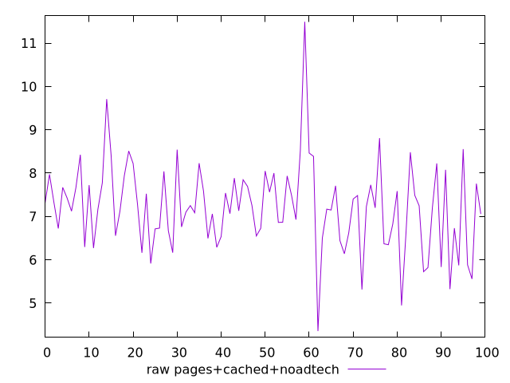
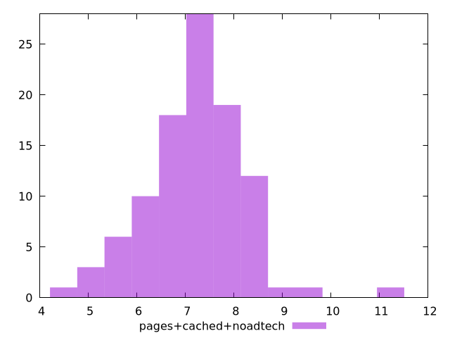

# Report pages+cached+noadtech

[parent..](./..)  


## Scores

  

## Score Histogram

  

## Score Indicators

```yaml
{}

```

## Raw Values

  

## Raw Values Histogram

  

## Raw Indicators

```yaml
min: 4.356800000000001
max: 11.4937
range: 7.1369
mean: 7.205653999999998
median: 7.20195
stdev: 1.0031505676038868
skewness: 0.47353173400353504

```

<style>
  img {
    max-width: 80%;
  }
</style>
      
