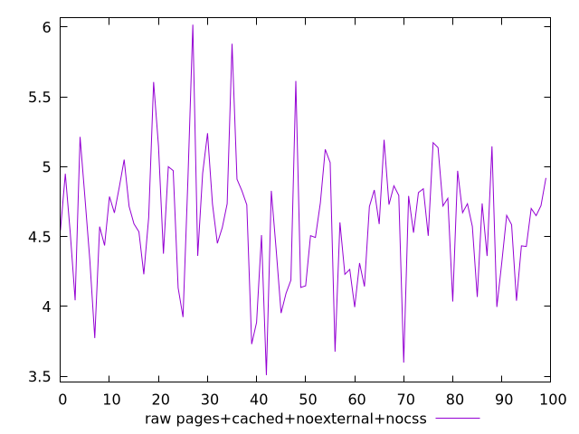
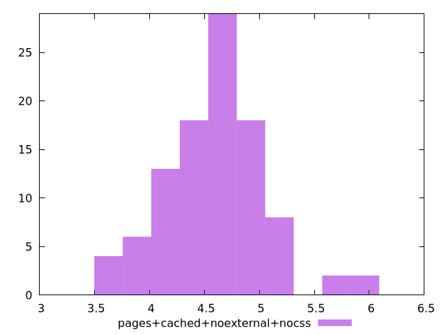

# Report pages+cached+noexternal+nocss

[parent..](./..)  


## Scores

  

## Score Histogram

  

## Score Indicators

```yaml
{}

```

## Raw Values

  

## Raw Values Histogram

  

## Raw Indicators

```yaml
min: 3.5081
max: 6.0171
range: 2.509
mean: 4.601645
median: 4.642899999999999
stdev: 0.4533799815552073
skewness: 0.19767364200388518

```

<style>
  img {
    max-width: 80%;
  }
</style>
      
