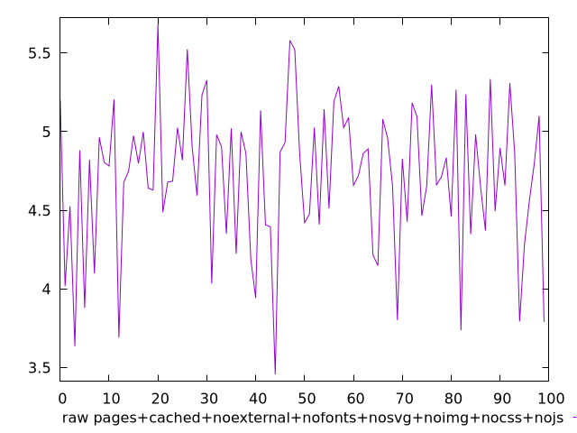
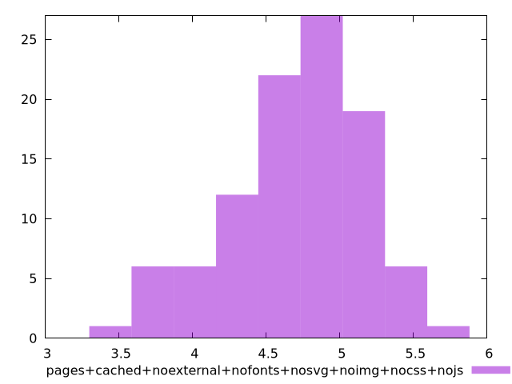

# Report pages+cached+noexternal+nofonts+nosvg+noimg+nocss+nojs

[parent..](./..)  


## Scores

  

## Score Histogram

  

## Score Indicators

```yaml
{}

```

## Raw Values

  

## Raw Values Histogram

  

## Raw Indicators

```yaml
min: 3.4577
max: 5.680599999999999
range: 2.222899999999999
mean: 4.712676999999999
median: 4.7979
stdev: 0.4603154541952724
skewness: -0.5283205112671311

```

<style>
  img {
    max-width: 80%;
  }
</style>
      
