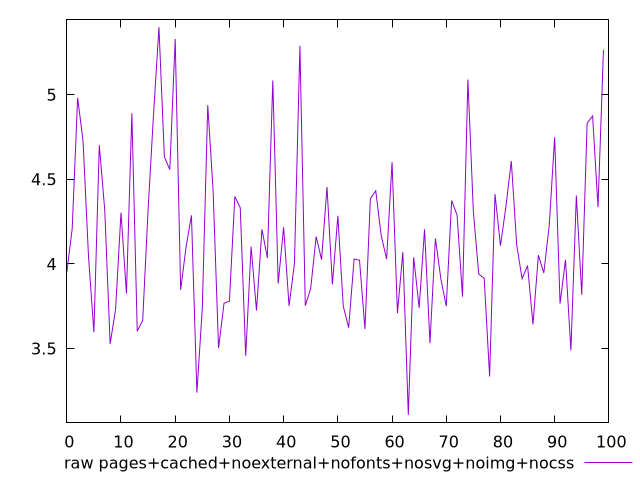
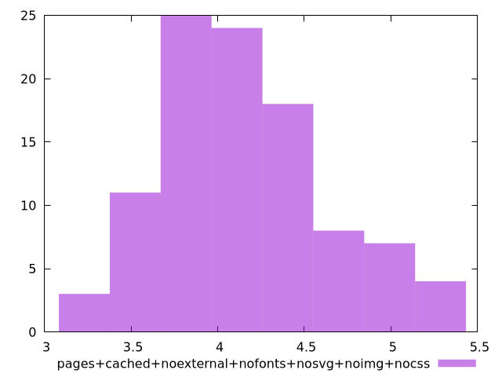

# Report pages+cached+noexternal+nofonts+nosvg+noimg+nocss

[parent..](./..)  


## Scores

  

## Score Histogram

  

## Score Indicators

```yaml
{}

```

## Raw Values

  

## Raw Values Histogram

  

## Raw Indicators

```yaml
min: 3.1083
max: 5.3986
range: 2.2903000000000002
mean: 4.145832999999999
median: 4.0611500000000005
stdev: 0.47646289384484086
skewness: 0.5852481085020309

```

<style>
  img {
    max-width: 80%;
  }
</style>
      
