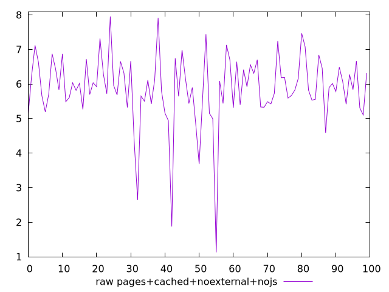
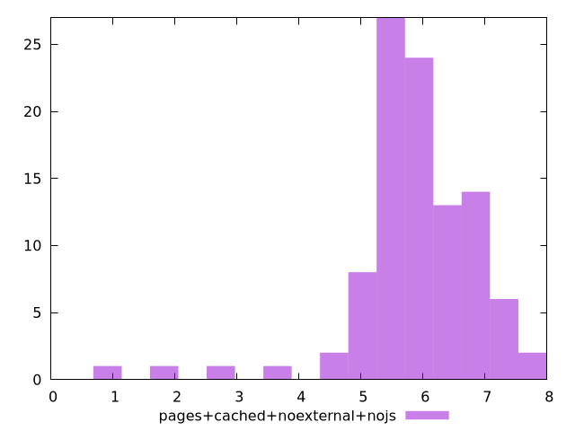

# Report pages+cached+noexternal+nojs

[parent..](./..)  


## Scores

  

## Score Histogram

  

## Score Indicators

```yaml
{}

```

## Raw Values

  

## Raw Values Histogram

  

## Raw Indicators

```yaml
min: 1.125
max: 7.9501
range: 6.8251
mean: 5.864535999999999
median: 5.8629500000000005
stdev: 1.0150635926403822
skewness: -1.6992286406819581

```

<style>
  img {
    max-width: 80%;
  }
</style>
      
