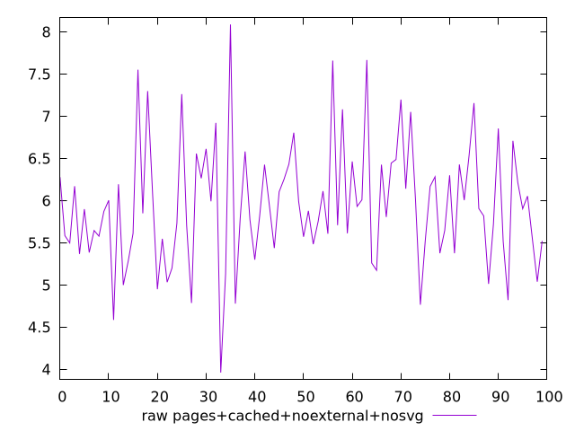
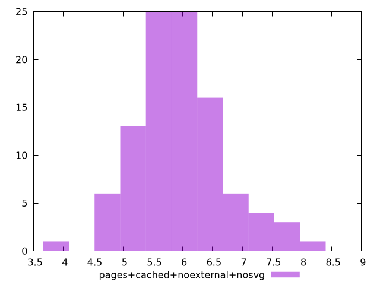

# Report pages+cached+noexternal+nosvg

[parent..](./..)  


## Scores

  

## Score Histogram

  

## Score Indicators

```yaml
{}

```

## Raw Values

  

## Raw Values Histogram

  

## Raw Indicators

```yaml
min: 3.9623
max: 8.087900000000001
range: 4.125600000000001
mean: 5.946647
median: 5.88875
stdev: 0.7234081338297215
skewness: 0.4061435149466506

```

<style>
  img {
    max-width: 80%;
  }
</style>
      
