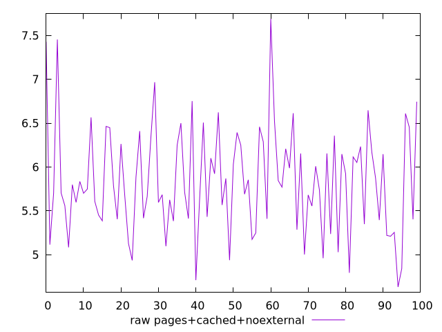
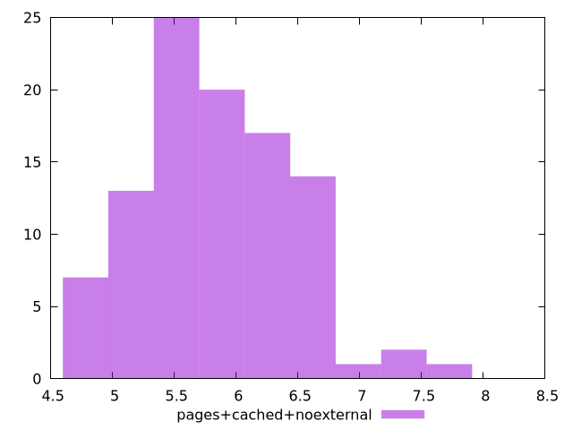

# Report pages+cached+noexternal

[parent..](./..)  


## Scores

  

## Score Histogram

  

## Score Indicators

```yaml
{}

```

## Raw Values

  

## Raw Values Histogram

  

## Raw Indicators

```yaml
min: 4.6316
max: 7.6887
range: 3.0571
mean: 5.836010999999998
median: 5.759049999999999
stdev: 0.603547553370072
skewness: 0.47180821308963294

```

<style>
  img {
    max-width: 80%;
  }
</style>
      
