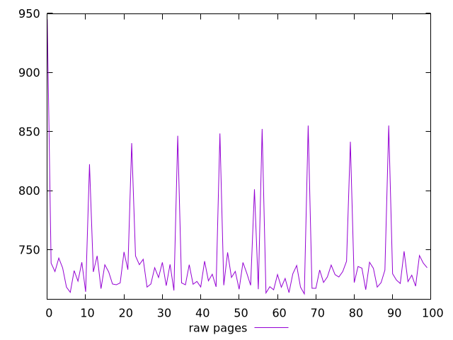
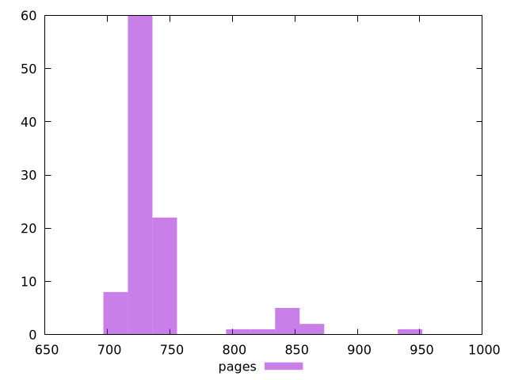

# Report pages

[parent..](./..)  


## Scores

  

## Score Histogram

  

## Score Indicators

```yaml
{}

```

## Raw Values

  

## Raw Values Histogram

  

## Raw Indicators

```yaml
min: 712.569
max: 945.0389999999999
range: 232.4699999999999
mean: 740.1945999999999
median: 729.3795
stdev: 39.545001648248785
skewness: 2.890686010963478

```

<style>
  img {
    max-width: 80%;
  }
</style>
      
