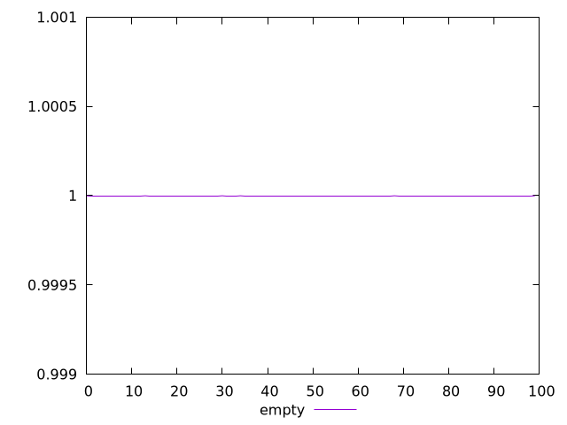
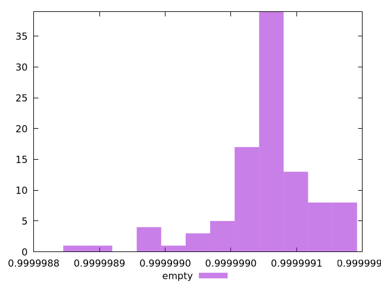

# Report empty

[parent..](./..)  


## Scores

  

## Score Histogram

  

## Score Indicators

```yaml
min: 0.999998883113331
max: 0.999999084589487
range: 2.0147615609200642e-7
mean: 0.9999990290625763
median: 0.9999990340787854
stdev: 3.5765693794854436e-8
skewness: -1.5273157876179757

```

## Raw Values

  

## Raw Values Histogram

  

## Raw Indicators

```yaml
{}

```

<style>
  img {
    max-width: 80%;
  }
</style>
      
