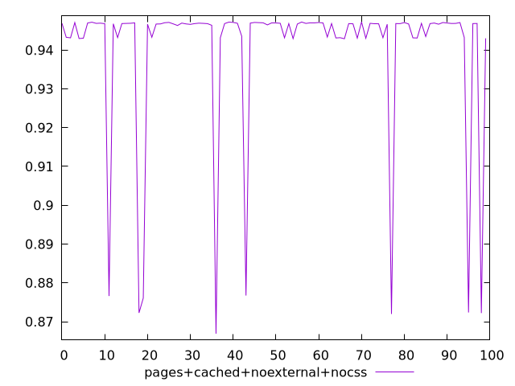
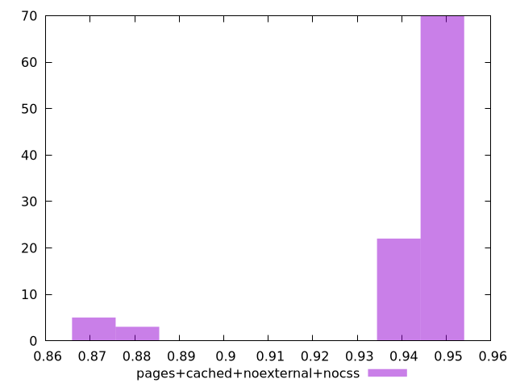

# Report pages+cached+noexternal+nocss

[parent..](./..)  


## Scores

  

## Score Histogram

  

## Score Indicators

```yaml
min: 0.8669269914328439
max: 0.9472376389475392
range: 0.0803106475146953
mean: 0.9401569824340357
median: 0.9467952036577485
stdev: 0.019836432197143882
skewness: -3.0747650154525674

```

## Raw Values

  

## Raw Values Histogram

  

## Raw Indicators

```yaml
{}

```

<style>
  img {
    max-width: 80%;
  }
</style>
      
