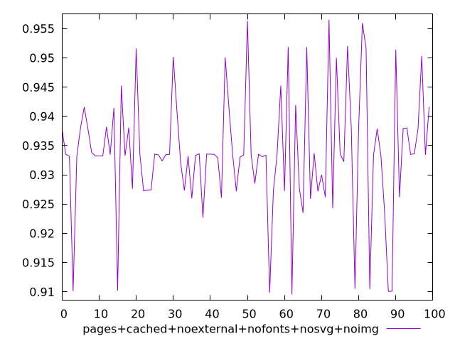
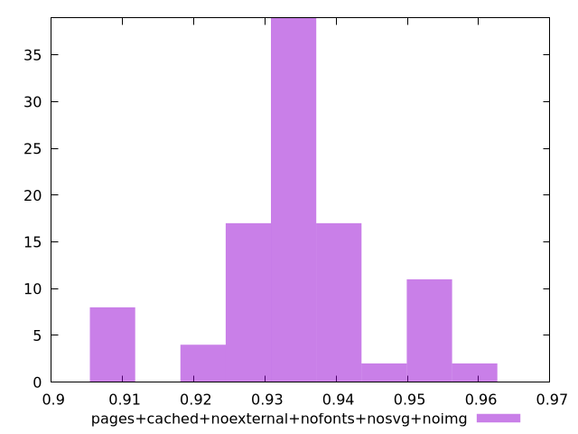

# Report pages+cached+noexternal+nofonts+nosvg+noimg

[parent..](./..)  


## Scores

  

## Score Histogram

  

## Score Indicators

```yaml
min: 0.909549516258911
max: 0.9565363384250842
range: 0.046986822166173225
mean: 0.9337428523371591
median: 0.9334392269858944
stdev: 0.010495919881572198
skewness: -0.18581807299486905

```

## Raw Values

  

## Raw Values Histogram

  

## Raw Indicators

```yaml
{}

```

<style>
  img {
    max-width: 80%;
  }
</style>
      
