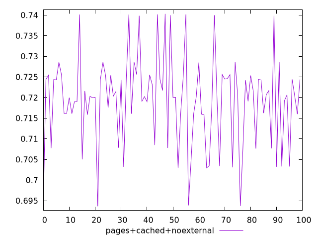
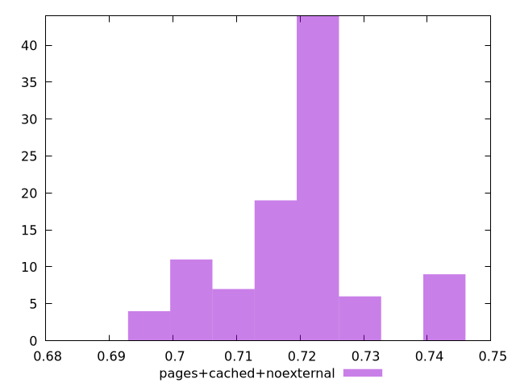

# Report pages+cached+noexternal

[parent..](./..)  


## Scores

  

## Score Histogram

  

## Score Indicators

```yaml
min: 0.693633431382311
max: 0.7403007450655116
range: 0.04666731368320054
mean: 0.719370891651772
median: 0.72030690010244
stdev: 0.01076232921684792
skewness: -0.27224017134394424

```

## Raw Values

  

## Raw Values Histogram

  

## Raw Indicators

```yaml
{}

```

<style>
  img {
    max-width: 80%;
  }
</style>
      
