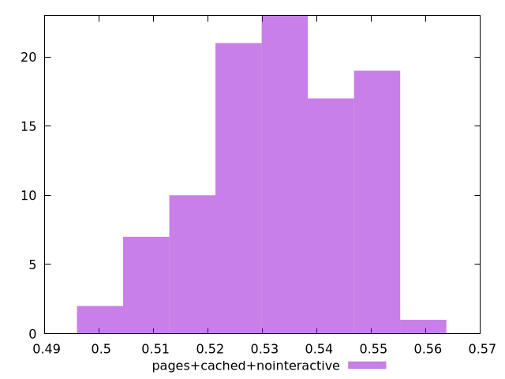

# Report pages+cached+nointeractive

[parent..](./..)  


## Scores

  

## Score Histogram

  

## Score Indicators

```yaml
min: 0.4987142483890919
max: 0.5557012301041877
range: 0.05698698171509581
mean: 0.5334921907021536
median: 0.5327911364534887
stdev: 0.013116735218975996
skewness: -0.384374384692772

```

## Raw Values

  

## Raw Values Histogram

  

## Raw Indicators

```yaml
{}

```

<style>
  img {
    max-width: 80%;
  }
</style>
      
