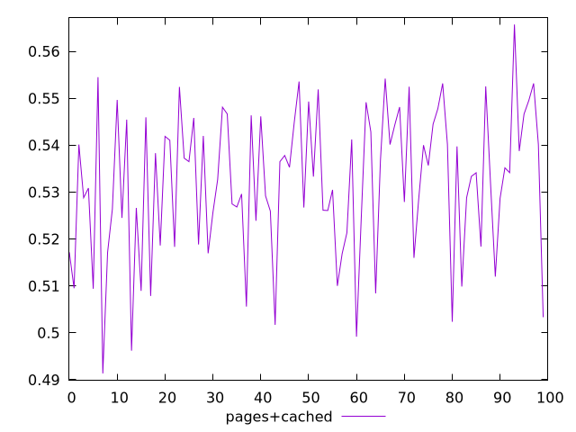
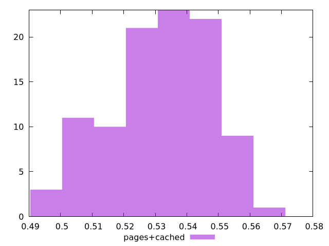

# Report pages+cached

[parent..](./..)  


## Scores

  

## Score Histogram

  

## Score Indicators

```yaml
min: 0.4913536541653386
max: 0.5657115031025787
range: 0.07435784893724007
mean: 0.5318723561861073
median: 0.533736289169291
stdev: 0.015503423254760975
skewness: -0.4484118846468988

```

## Raw Values

  

## Raw Values Histogram

  

## Raw Indicators

```yaml
{}

```

<style>
  img {
    max-width: 80%;
  }
</style>
      
