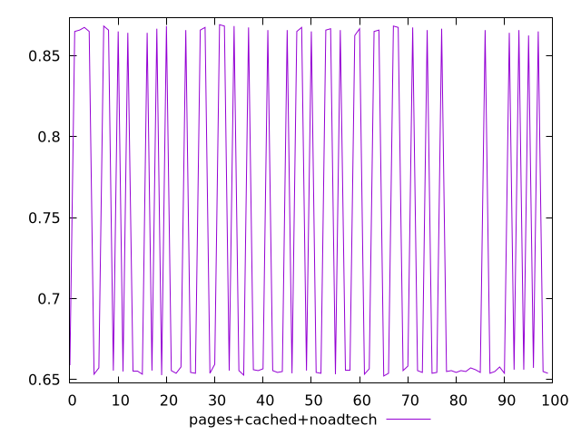
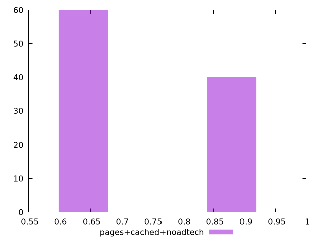
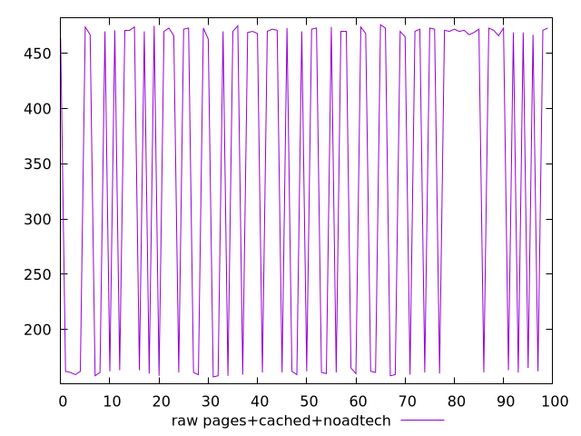
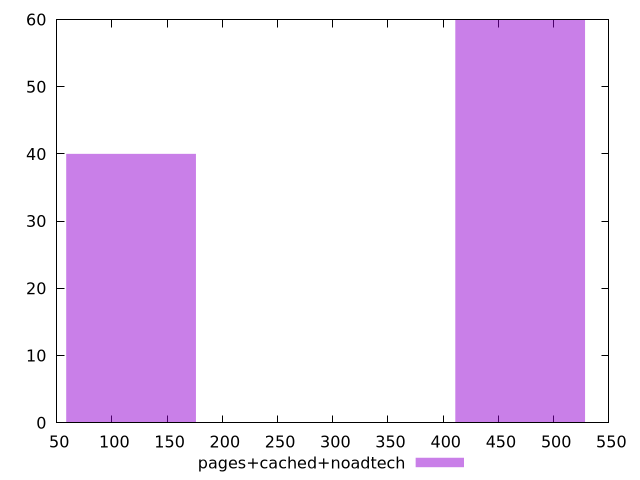

# Report pages+cached+noadtech

[parent..](./..)  


## Scores

  

## Score Histogram

  

## Score Indicators

```yaml
min: 0.6522222222222223
max: 0.8691666666666666
range: 0.21694444444444438
mean: 0.7395555555555555
median: 0.6563888888888889
stdev: 0.10335446319210596
skewness: 0.40813860710419597

```

## Raw Values

  

## Raw Values Histogram

  

## Raw Indicators

```yaml
min: 157
max: 476
range: 319
mean: 346.67
median: 468.5
stdev: 151.90326230861538
skewness: -0.40786037176815576

```

<style>
  img {
    max-width: 80%;
  }
</style>
      
