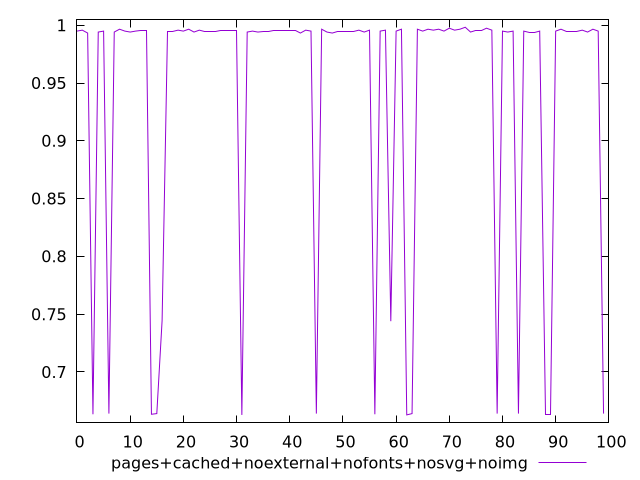
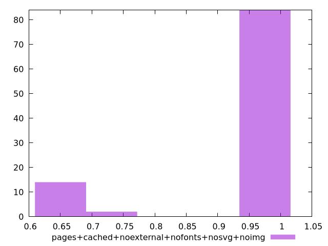
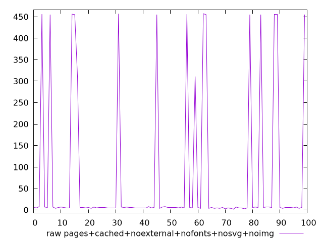
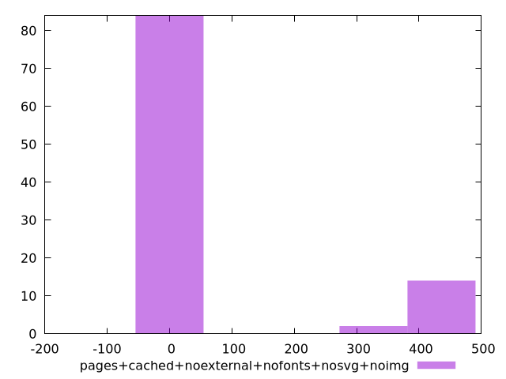

# Report pages+cached+noexternal+nofonts+nosvg+noimg

[parent..](./..)  


## Scores

  

## Score Histogram

  

## Score Indicators

```yaml
min: 0.6627777777777778
max: 0.9983333333333333
range: 0.3355555555555555
mean: 0.943869444444445
median: 0.995
stdev: 0.11843504532620303
skewness: -1.8835064469217797

```

## Raw Values

  

## Raw Values Histogram

  

## Raw Indicators

```yaml
min: 2
max: 457
range: 455
mean: 74.69
median: 6
stdev: 159.50678324134054
skewness: 1.9035100671439364

```

<style>
  img {
    max-width: 80%;
  }
</style>
      
