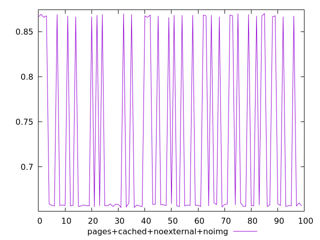
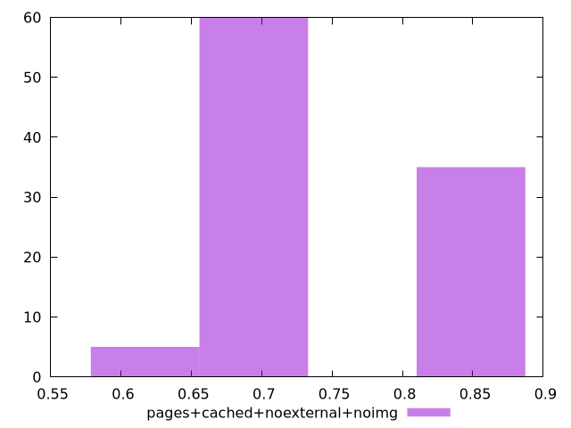
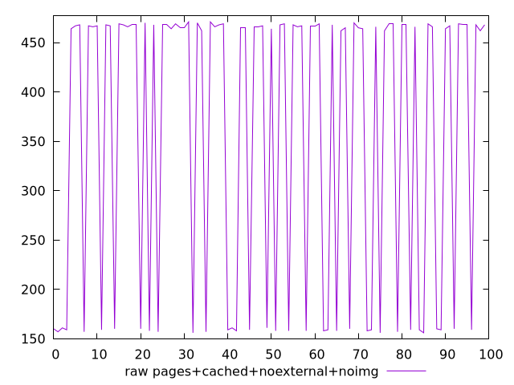
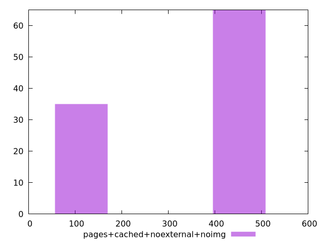

# Report pages+cached+noexternal+noimg

[parent..](./..)  


## Scores

  

## Score Histogram

  

## Score Indicators

```yaml
min: 0.655
max: 0.87
range: 0.21499999999999997
mean: 0.730961111111111
median: 0.6580555555555556
stdev: 0.10046099313651694
skewness: 0.6288358850310057

```

## Raw Values

  

## Raw Values Histogram

  

## Raw Indicators

```yaml
min: 156
max: 471
range: 315
mean: 359.02
median: 465.5
stdev: 147.1011883024743
skewness: -0.6286460935801416

```

<style>
  img {
    max-width: 80%;
  }
</style>
      
